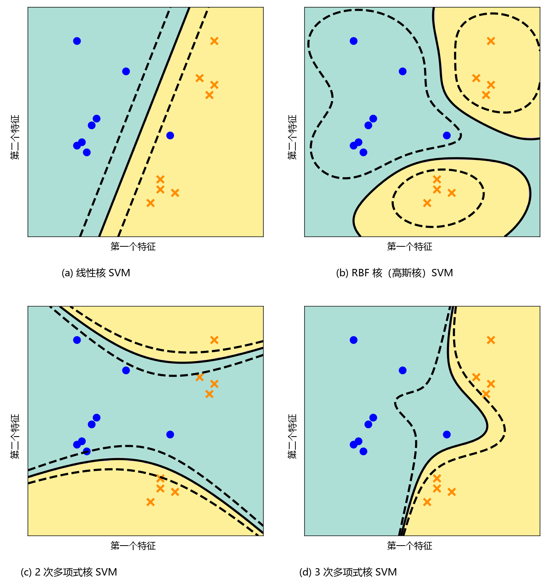

# 12.4 核方法

考虑对偶支持向量机的优化公式 (12.41)。值得高度关注的是：在对偶目标函数中，内积 **仅仅出现在样本对 $\boldsymbol{x}_i$ 与 $\boldsymbol{x}_j$ 之间**，而完全不涉及样本与模型参数之间的内积运算。

因此，如果我们考虑使用一组特征变换 $\boldsymbol{\phi}(\boldsymbol{x}_i)$ 来表示样本 $\boldsymbol{x}_i$，对偶 SVM 所需进行的唯一调整就是将原有的内积进行替换。这种 **高度的模块化解耦（modularity）**——将分类方法本身（SVM 优化框架）与特征表示的选择 $\boldsymbol{\phi}(\boldsymbol{x})$ 完全分离——赋予了我们极其灵活的自由度，使我们能够完全独立地探索与优化这两个核心环节。在本节中，我们重点讨论特征表示 $\boldsymbol{\phi}(\boldsymbol{x})$ 并简要介绍 **核方法（Kernels）** 的核心思想。

由于 $\boldsymbol{\phi}(\boldsymbol{x})$ 可以是一个高度复杂的非线性函数，我们能够直接利用假定线性分类边界的 SVM，构造出关于原始输入样本 $\boldsymbol{x}_n$ 具有高度非线性决策边界的强大分类器。除了软间隔之外，这为机器学习从业者处理线性不可分数据集提供了第二条极为广阔的解决路径。

在现代机器学习与统计学中，许多算法和统计方法都展现出了我们在对偶 SVM 中所观察到的这一美妙特性：**模型所需的全部数据信息均可仅通过样本之间的内积来完整表达**。

与其显式地定义一个高维甚至无限维的非线性特征映射 $\boldsymbol{\phi}(\cdot)$ 并直接计算映射后的内积，我们可以直接定义一个度量样本 $\boldsymbol{x}_i$ 与 $\boldsymbol{x}_j$ 之间相似度的二元函数 $k(\boldsymbol{x}_i, \boldsymbol{x}_j)$。对于满足特定数学条件的一类相似度函数（称为 **核函数（kernels）**），该相似度函数隐式地定义了某个再生核希尔伯特空间中的非线性特征映射 $\boldsymbol{\phi}(\cdot)$。

---

**定义（核函数）**  
核函数在数学上定义为函数 $k : \mathcal{X} \times \mathcal{X} \to \mathbb{R}$，对于该函数，存在一个希尔伯特空间 $\mathcal{H}$ 以及特征映射 $\boldsymbol{\phi} : \mathcal{X} \to \mathcal{H}$，使得：

$$
k(\boldsymbol{x}_i, \boldsymbol{x}_j) = \langle \boldsymbol{\phi}(\boldsymbol{x}_i), \boldsymbol{\phi}(\boldsymbol{x}_j) \rangle_{\mathcal{H}} .
\tag{12.52}
$$

这里核函数的输入空间 $\mathcal{X}$ 可以极其广泛，完全不局限于实数向量空间 $\mathbb{R}^D$。

---

与每一个满足条件的对称正定核函数 $k$ 相伴的，存在一个唯一确定的 **再生核希尔伯特空间（Reproducing Kernel Hilbert Space, RKHS）**（Aronszajn, 1950; Berlinet and Thomas-Agnan, 2004）。在这个唯一对应关系中，映射 $\boldsymbol{\phi}(\boldsymbol{x}) = k(\cdot, \boldsymbol{x})$ 被称为 **典型特征映射（canonical feature map）**。

从直接内积计算向核函数 (12.52) 的推广在机器学习中被称为著名的 **核技巧（kernel trick）**（Schölkopf and Smola, 2002; Shawe-Taylor and Cristianini, 2004）。核技巧的核心精髓在于：它完全隐藏了显式非线性高维特征映射的具体构造与计算。

由内积或将核函数 $k(\cdot, \cdot)$ 作用于整个训练数据集所生成的矩阵 $\boldsymbol{K} \in \mathbb{R}^{N \times N}$ 被称为 **Gram 矩阵（Gram matrix）**，在机器学习中通常简称为 **核矩阵（kernel matrix）**。核函数必须是对称半正定的，因此由任意样本集生成的核矩阵 $\boldsymbol{K}$ 必然是对称半正定矩阵（参见 3.2.3 节）：

$$
\forall \boldsymbol{z} \in \mathbb{R}^N : \boldsymbol{z}^\top \boldsymbol{K} \boldsymbol{z} \geqslant 0 .
\tag{12.53}
$$

  
  
<b>图 12.10</b> 采用不同核函数的支持向量机在同一数据集上的分类决策面效果对比。需要特别注意：尽管输入空间中的最终决策边界呈现高度非线性，但底层的凸优化问题求解的依然是高维特征空间中的线性超平面（只不过借助非线性核函数隐式诱导而成）。

对于多元实值数据 $\boldsymbol{x}_i \in \mathbb{R}^D$，几种最常用且最具代表性的经典核函数包括（Schölkopf and Smola, 2002; Rasmussen and Williams, 2006）：
1. **多项式核（Polynomial Kernel）**：$k(\boldsymbol{x}_i, \boldsymbol{x}_j) = (\boldsymbol{x}_i^\top \boldsymbol{x}_j + c)^d$；
2. **高斯径向基函数核（Gaussian RBF Kernel，亦称高斯核）**：$k(\boldsymbol{x}_i, \boldsymbol{x}_j) = \exp\left(-\frac{\|\boldsymbol{x}_i - \boldsymbol{x}_j\|^2}{2\sigma^2}\right)$；
3. **有理二次核（Rational Quadratic Kernel）**。

图 12.10 直观对比了不同核函数在相同数据集上的分隔决策面表现：线性核产生笔直的线性决策面，而多项式核与高斯 RBF 核能够平滑自适应地弯曲并紧密包裹数据簇。

---

**说明（关于“核（Kernel）”一词的三种不同数学含义）**  
对于初入机器学习领域的学者而言，“核（Kernel）”一词在不同数学语境下具有完全不同的含义，极易产生混淆：
1. **再生核（Reproducing Kernel）**：在本章中，“核”特指再生核希尔伯特空间（RKHS）中的对称正定核函数（Aronszajn, 1950; Saitoh, 1988）；
2. **线性代数中的核（Kernel / Null Space）**：在 2.7.3 节的线性代数中，“核”是零空间（null space）的同义词，即满足线性变换映射为零向量的所有向量构成的子空间；
3. **核密度估计中的平滑核（Smoothing Kernel）**：在 11.5 节非参数概率密度估计中，“核”指代积分为 1 的局部平滑加权窗口函数。  
♦

---

由于显式特征表示 $\boldsymbol{\phi}(\boldsymbol{x})$ 在数学上与核表示 $k(\boldsymbol{x}_i, \boldsymbol{x}_j)$ 完全等价，在实践中工程师通常优先设计能够比显式特征内积计算高效得多的核函数：
- 例如在 **多项式核** 中，显式展开后的单项式项数随特征维度指数级暴增（即使是低阶多项式，高维展开也是无法承受的）；而多项式核函数计算仅需先在低维执行一次内积标量运算，随后进行一次标量幂运算，带来极其显著的计算加速；
- 在 **高斯 RBF 核** 中，其所诱导的特征空间维度在数学上是 **无穷维（infinite-dimensional）** 的！在计算机中显式存储或表达无限维向量在物理上是不可能的，但借助高斯核函数，我们只需计算一次样本间的欧氏距离和指数函数，便能在有限时间内轻而易举地完成无限维特征空间中的内积运算！

核技巧的另一个极为重大的优势在于：**输入数据根本无需预先表示为实数向量**！注意到内积仅仅定义在特征映射函数的输出值 $\boldsymbol{\phi}(\boldsymbol{x}) \in \mathcal{H}$ 上，而对输入对象 $\mathcal{X}$ 的类型没有施加任何实数限制。因此，核函数 $k(\cdot, \cdot)$ 可以直接定义在任意复杂的离散或抽象非结构化对象上，例如集合、序列、文本字符串、图结构（Graph）乃至概率分布本身（Ben-Hur et al., 2008; Gärtner, 2008; Shi et al., 2009; Sriperumbudur et al., 2010; Vishwanathan et al., 2010）。在实际建模中，核函数的具体类型以及核超参数（如高斯核带宽 $\sigma$）通常借助嵌套交叉验证（8.6.1 节）进行系统搜索与选型。
