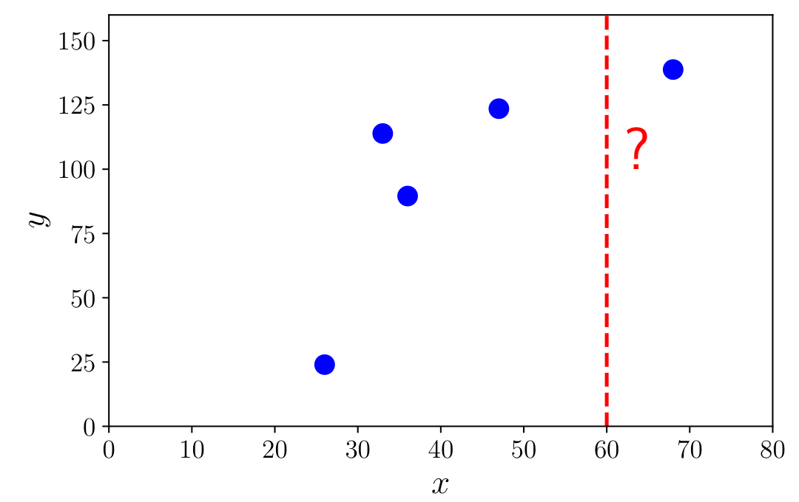
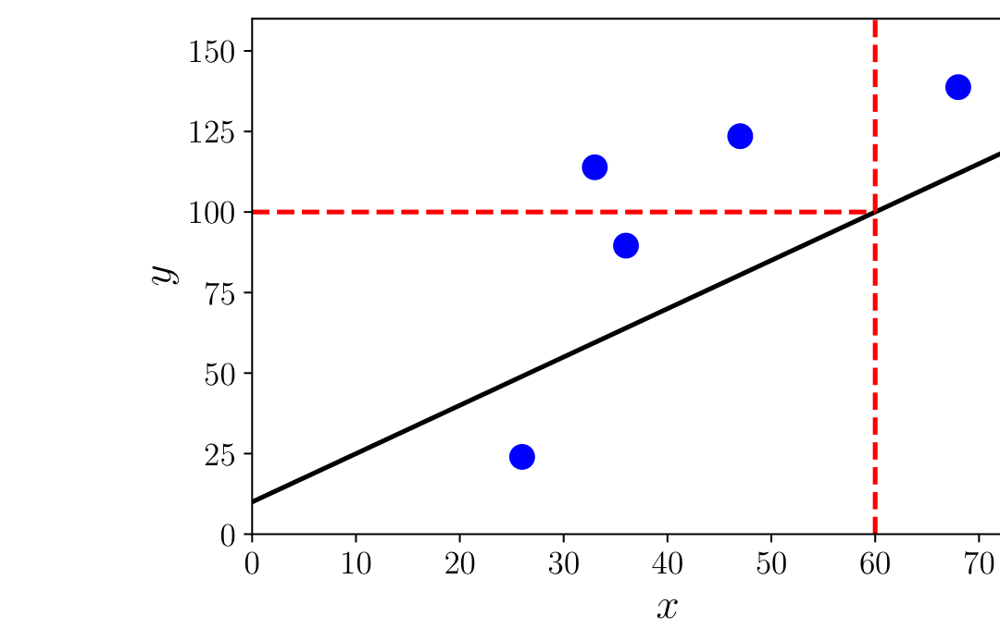
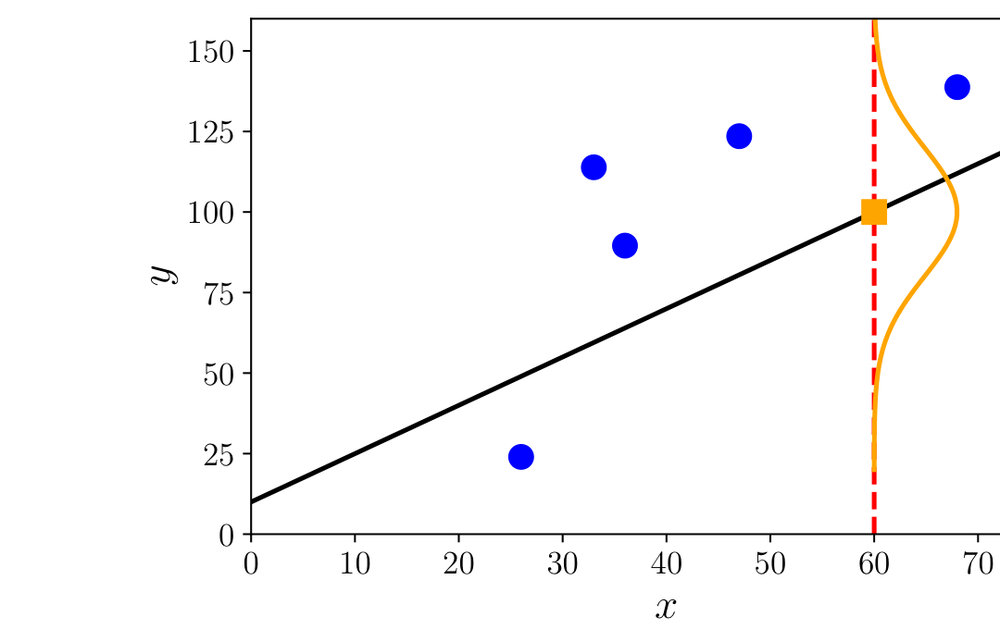

## 8.1 数据、模型与学习

在此刻，我们有必要停下来思考一下机器学习算法旨在解决的问题。正如第 1 章中所讨论的，机器学习系统由三个主要组成部分构成：数据、模型与学习。机器学习的核心问题在于“什么样的模型才算好模型？”。“模型”（model）这个词有许多微妙之处，我们将在本章中多次重温它。如何客观地定义“好”也并非显而易见。机器学习的指导原则之一是，优秀的模型应该在未见过的数据上表现良好。这就需要我们定义一些性能指标，例如准确率或与真实值的距离，并找出在这些性能指标下表现良好的方法。本章涵盖了常用于讨论机器学习模型的一些必要的数学与统计语言。通过这种方式，我们简要概述了当前训练模型的最佳实践，使得到的预测器在未见过的数据上表现出色。

如第 1 章所述，我们在两种不同意义上使用“机器学习算法”这一短语：训练与预测。我们将在本章描述这些概念，以及在不同模型之间进行选择的思想。我们将在 8.2 节介绍经验风险最小化框架，在 8.3 节介绍极大似然原理，并在 8.4 节介绍概率模型的思想。我们在 8.5 节简要概述用于指定概率模型的图语言，最后在 8.6 节讨论模型选择。本节的其余部分将详细阐述机器学习的三大核心组成部分：数据、模型与学习。

---

### 8.1.1 作为向量的数据

我们假设数据可以被计算机读取，并以适当的数值格式表示。数据通常假设为表格形式（图 8.1），其中表的每一行代表一个特定的实例或样本，每一列代表一个特定的特征。近年来，机器学习已应用于许多显然不是以表格数值格式出现的数据类型，例如基因组序列、网页的文本与图像内容以及社交媒体图谱。我们在此不探讨识别优质特征这一重要且具有挑战性的方面。这些方面很大程度上依赖于领域专业知识并需要精细的工程设计，近年来它们被归入数据科学（data science）的范畴（Stray, 2016; Adhikari and DeNero, 2018）。

即使我们拥有表格格式的数据，在获取数值表示时仍有许多选择需要权衡。例如，在表 8.1 中，性别列（分类变量）可以转换为数字：0 表示“男”（Male），1 表示“女”（Female）。或者，性别也可以分别用数字 $-1$ 和 $+1$ 表示（如表 8.2 所示）。此外，在构建表示时利用领域知识通常至关重要，例如了解大学学位是从学士到硕士再到博士逐步晋升的，或者意识到所提供的邮政编码不仅仅是一串字符，而是实际编码了伦敦的一个区域。在表 8.2 中，我们将表 8.1 的数据转换为数值格式，每个邮政编码表示为两个数字：纬度与经度。即便是可能直接输入机器学习算法的数值数据，也应仔细考虑其单位、尺度和约束。在没有额外信息的情况下，通常应平移和缩放数据集的所有列，使它们的经验均值为 0，经验方差为 1。就本书而言，我们假设领域专家已经适当地转换了数据，即每个输入 $\boldsymbol{x}_n$ 是一个由实数组成的 $D$ 维向量，这些实数被称为 _特征（features）_ 、 _ 属性（attributes）_ 或 _ 协变量（covariates）_ 。我们认为数据集的形式如表 8.2 所示。请注意，在新的数值表示中我们去掉了表 8.1 中的“姓名”列。这样做有两个主要原因：（1）我们不认为标识符（姓名）对机器学习任务具有信息量；（2）我们可能希望对数据进行匿名化处理，以保护员工的隐私。

**表 8.1** 虚构的人力资源数据库中的示例数据，非数值格式。

| 姓名 | 性别 | 学位 | 邮编 | 年龄 | 年薪 |
| :--- | :--- | :--- | :--- | :--- | :--- |
| Aditya | M | MSc | W21BG | 36 | 89563 |
| Bob | M | PhD | EC1A1BA | 47 | 123543 |
| Chloé | F | BEcon | SW1A1BH | 26 | 23989 |
| Daisuke | M | BSc | SE207AT | 68 | 138769 |
| Elisabeth | F | MBA | SE10AA | 33 | 113888 |

 

**表 8.2** 表 8.1 中虚构的人力资源数据库示例数据转换为数值格式后的结果。

| 性别代码 | 学位 | 纬度（度） | 经度（度） | 年龄 | 年薪（千元） |
| :---: | :---: | :---: | :---: | :---: | :---: |
| -1 | 2 | 51.5073 | 0.1290 | 36 | 89.563 |
| -1 | 3 | 51.5074 | 0.1275 | 47 | 123.543 |
| +1 | 1 | 51.5071 | 0.1278 | 26 | 23.989 |
| -1 | 1 | 51.5075 | 0.1281 | 68 | 138.769 |
| +1 | 2 | 51.5074 | 0.1278 | 33 | 113.888 |

 

在本书的这一部分中，我们将用 $N$ 表示数据集中的样本数量，并用小写字母 $n = 1, \ldots, N$ 对样本建立索引。我们假设给定一组数值数据，表示为向量数组（表 8.2）。每一行是一个特定的个体 $\boldsymbol{x}_n$，在机器学习中通常被称为 _样本（example）_ 或 _ 数据点（data point）_ 。下标 $n$ 表示这是数据集中总共 $N$ 个样本中的第 $n$ 个样本。每一列代表该样本感兴趣的特定特征，我们将特征索引为 $d = 1, \ldots, D$。回想一下，数据被表示为向量，这意味着每个样本（每个数据点）是一个 $D$ 维向量。表格的这种排布方式源于数据库领域的习惯，但对于某些机器学习算法（例如在第 10 章中），将样本表示为列向量会更为方便。

让我们考虑根据表 8.2 中的数据从年龄预测年薪的问题。这是一个 _监督学习（supervised learning）_ 问题，其中每个样本 $\boldsymbol{x}_n$（年龄）都关联有一个 _标签（label）_ $y_n$（薪资）。标签 $y_n$ 还有其他各种名称，包括 _目标（target）_ 、 _ 响应变量（response variable）_ 和 _ 标注（annotation）_ 。数据集通常写作“样本-标签”对的集合 $\{(\boldsymbol{x}_1, y_1), \ldots, (\boldsymbol{x}_n, y_n), \ldots, (\boldsymbol{x}_N, y_N)\}$。样本构成的表 $\{\boldsymbol{x}_1, \ldots, \boldsymbol{x}_N\}$ 通常拼接在一起，写作 $\boldsymbol{X} \in \mathbb{R}^{N \times D}$。图 8.1 展示了由表 8.2 最右侧两列构成的数据集，其中 $x = \text{年龄}$，$y = \text{薪资}$。

  
  
<b>图 8.1</b> 用于线性回归的简单示例数据。训练数据为来自表 8.2 最右侧两列的 (xₙ, yₙ) 数据对。我们感兴趣的是一名 60 岁人员（x = 60，图中用红色虚线表示）的薪资，该点不属于训练数据。

我们利用本书第一部分介绍的概念将诸如前段所述的机器学习问题形式化。将数据表示为向量 $\boldsymbol{x}_n$ 使我们能够运用线性代数中的概念（在第 2 章中介绍）。在许多机器学习算法中，我们还需要能够比较两个向量。正如我们将在第 9 章和第 12 章中看到的，计算两个样本之间的相似度或距离使我们能够形式化这一直觉：具有相似特征的样本应该具有相似的标签。两个向量的比较需要我们构建某种几何结构（在第 3 章中解释），并允许我们利用第 7 章的技术对得到的学习问题进行优化。

由于我们将数据表示为向量，我们可以操纵数据以寻找其潜在更优的表示。我们将从两个方面探讨寻找良好表示的方法：寻找原始特征向量的低维近似，以及利用原始特征向量的非线性高维组合。在第 10 章中，我们将看到通过寻找主成分来得到原始数据空间低维近似的示例。寻找主成分与第 4 章中介绍的特征值和奇异值分解概念密切相关。对于高维表示，我们将看到一个显式特征映射 $\phi(\cdot)$，它允许我们使用更高维的表示 $\phi(\boldsymbol{x}_n)$ 来表示输入 $\boldsymbol{x}_n$。高维表示的主要动机在于，我们可以将新特征构建为原始特征的非线性组合，这反过来可能使学习问题变得更容易。我们将在 9.2 节讨论特征映射，并在 12.4 节展示该特征映射如何引出 _核（kernel）_ 。近年来，深度学习方法（Goodfellow et al., 2016）在利用数据本身学习新的优质特征方面展现出巨大潜力，并在计算机视觉、语音识别和自然语言处理等领域取得了巨大成功。我们在本书的这部分内容中不涵盖神经网络，但读者可参阅 5.6 节了解反向传播的数学描述，这是训练神经网络的核心概念。

---

### 8.1.2 作为函数的模型

一旦我们将数据表示为适当的向量形式，就可以着手构建预测函数（称为 _预测器（predictor）_）。在第 1 章中，我们尚未具备精确描述模型的语言。利用本书第一部分的概念，我们现在可以介绍“模型”的具体含义。我们在本书中介绍两种主要方法：将预测器视为函数，以及将预测器视为概率模型。我们在本小节描述前者，在下一小节描述后者。

预测器是一个函数，当给定特定的输入样本（在我们的情况下为一个特征向量）时，产生一个输出。目前，我们考虑输出为一个单一数字，即实值标量输出。这可以写作：

$$
f : \mathbb{R}^D \to \mathbb{R} ,
\tag{8.1}
$$

其中输入向量 $\boldsymbol{x}$ 是 $D$ 维的（具有 $D$ 个特征），应用于它的函数 $f$（写作 $f(\boldsymbol{x})$）返回一个实数。图 8.2 展示了一个可用于计算输入值 $x$ 对应预测值的可能函数。

  
  
<b>图 8.2</b> 示例函数（黑色实面对角线）及其在 x = 60 处的预测值，即 f(60) = 100。

在本书中，我们不考虑所有函数的一般情形，那将需要泛函分析的知识。相反，我们考虑线性函数的特殊情形：

$$
f(\boldsymbol{x}) = \boldsymbol{\theta}^\top \boldsymbol{x} + \theta_0
\tag{8.2}
$$

其中 $\boldsymbol{\theta}$ 和 $\theta_0$ 为未知参数。这种限制意味着第 2 章和第 3 章的内容足以精确阐明机器学习非概率视角（相对于下文描述的概率视角）下的预测器概念。线性函数在可解决问题的一般性与所需基础数学知识量之间取得了良好的平衡。

---

### 8.1.3 作为概率分布的模型

我们常常认为数据是对某种真实潜在效应的带噪观测，并希望通过应用机器学习能够从噪声中识别出信号。这要求我们具备量化噪声影响的语言。我们通常还希望预测器能够表达某种不确定性，例如量化我们对特定测试数据点的预测值的置信度。正如我们在第 6 章中所见，概率论提供了量化不确定性的语言。图 8.3 将该函数的预测不确定性展示为一个高斯分布。

  
  
<b>图 8.3</b> 示例函数（黑色实面对角线）及其在 x = 60 处的预测不确定性（绘制为高斯分布）。

我们可以不将预测器视为单个函数，而是将预测器视为概率模型，即描述可能函数分布的模型。在本书中，我们仅限于具有有限维参数的分布这一特殊情形，这使我们能够在不需要随机过程和随机测度的情况下描述概率模型。对于这种特殊情形，我们可以将概率模型视为多元概率分布，这已经允许构建非常丰富的模型类别。

我们将在 8.4 节介绍如何利用概率概念（第 6 章）来定义机器学习模型，并在 8.5 节介绍一种以紧凑方式描述概率模型的图语言。

---

### 8.1.4 学习即寻找参数

学习的目标是找到一个模型及其对应的参数，使得得到的预测器在未见过的数据上表现良好。在讨论机器学习算法时，概念上有三个截然不同的算法阶段：
1. **预测或推断**（Prediction or inference）
2. **训练或参数估计**（Training or parameter estimation）
3. **超参数调优或模型选择**（Hyperparameter tuning or model selection）

预测阶段是指我们在之前未见过的测试数据上使用训练好的预测器。换句话说，此时参数和模型选择已经固定，预测器应用于表示新输入数据点的新向量。正如第 1 章和前一小节所述，我们将在本书中探讨机器学习的两大流派，分别对应预测器是函数还是概率模型。当我们拥有概率模型（在 8.4 节中进一步讨论）时，预测阶段被称为 _推断（inference）_ 。

> **备注**  
> 遗憾的是，不同的算法阶段并没有公认统一的命名。单词“推断”（inference）有时也被用来表示概率模型的参数估计，而在较少情况下也可用于表示非概率模型的预测。

训练或参数估计阶段是指我们根据训练数据调整预测模型的阶段。我们希望在给定训练数据的情况下找到优秀的预测器，为此有两种主要策略：基于某种质量度量寻找最佳预测器（有时称为寻找 _点估计（point estimate）_），或使用贝叶斯推断。寻找点估计可以应用于这两种类型的预测器，但贝叶斯推断需要概率模型。

对于非概率模型，我们遵循 _经验风险最小化（empirical risk minimization）_ 原则，这将在 8.2 节中介绍。经验风险最小化直接为寻找良好参数提供了一个优化问题。对于统计模型，通常使用 _ 极大似然（maximum likelihood）_ 原则来寻找一组优秀的参数（8.3 节）。我们还可以使用概率模型对参数的不确定性进行建模，这将在 8.4 节中更详细地探讨。

我们使用数值方法来寻找与数据“拟合”的良好参数，大多数训练方法都可以看作是寻找目标函数最大值（例如极大似然）的爬山算法（hill-climbing）。为了应用爬山方法，我们使用第 5 章中描述的梯度，并实现第 7 章中的数值优化方法。

> **提示**  
> 优化领域的惯例是最小化目标函数。因此，在机器学习目标函数中常常会多出一个负号。

正如第 1 章所述，我们感兴趣的是基于数据学习一个模型，使其在未来的数据上表现良好。仅在训练数据上拟合良好是不够的，预测器需要在未见数据上表现良好。我们使用 _交叉验证（cross-validation）_ （8.2.4 节）来模拟预测器在未来未见数据上的表现。正如我们将在本章看到的，为了实现对未见数据表现良好的目标，我们需要在良好拟合训练数据与寻找现象的“简单”解释之间进行权衡。这种权衡是通过使用 _ 正则化（regularization）_ （8.2.3 节）或添加 _ 先验（prior）_ （8.3.2 节）来实现的。在哲学上，这既不被视为归纳（induction），也不被视为演绎（deduction），而是被称为 _ 溯因（abduction）_ 。根据《斯坦福哲学百科全书》，溯因是指“推向最佳解释的推断过程”（Douven, 2017）。

我们常常需要对预测器的结构做出高层次的建模决策，例如要使用的组件数量或要考虑的概率分布类别。组件数量的选择是 _超参数（hyperparameter）_ 的一个例子，这种选择会显著影响模型的性能。在不同模型之间进行选择的问题称为 _ 模型选择（model selection）_ ，我们将在 8.6 节中进行介绍。对于非概率模型，模型选择通常使用 _ 嵌套交叉验证（nested cross-validation）_ 进行，这将在 8.6.1 节中介绍。我们还利用模型选择来挑选模型的超参数。

> **备注**  
> 参数与超参数之间的界限有些随意，主要取决于什么可以通过数值直接优化，与什么需要采用搜索技术。理解这一区别的另一种视角是将参数视为概率模型的显式参数，并将超参数（更高层级的参数）视为控制这些显式参数分布的参数。

在接下来的各节中，我们将考察机器学习的三种风格：经验风险最小化（8.2 节）、极大似然原理（8.3 节）以及概率建模（8.4 节）。
