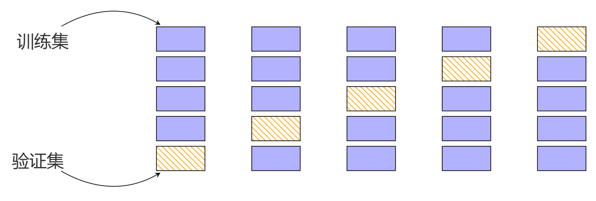

## 8.2 经验风险最小化

在掌握了所有的数学基础之后，我们现在可以阐明什么是“学习”了。机器学习中的“学习”部分归结为基于训练数据估计参数。在本节中，我们考虑预测器是一个函数的情形，并在 8.3 节中考虑概率模型的情形。我们在此描述 _经验风险最小化（empirical risk minimization）_ 的思想，该思想最初因支持向量机的提出（在第 12 章中描述）而广为人知。然而，它的一般原则具有广泛的适用性，使我们能够在不显式构建概率模型的情况下探讨什么是学习。这里有四个主要的设计选择，我们将在接下来的小节中详细讨论：
- 8.2.1 节：我们允许预测器采用的函数集合是什么？
- 8.2.2 节：我们如何度量预测器在训练数据上的表现优劣？
- 8.2.3 节：我们如何仅从训练数据构建出在未见过的测试数据上表现良好的预测器？
- 8.2.4 节：在模型空间中进行搜索的具体流程是什么？

---

### 8.2.1 假设函数类

假设给定 $N$ 个样本 $\boldsymbol{x}_n \in \mathbb{R}^D$ 及对应的标量标签 $y_n \in \mathbb{R}$。我们考虑监督学习设定，其中获取到数据对 $(\boldsymbol{x}_1, y_1), \ldots, (\boldsymbol{x}_N, y_N)$。给定这些数据，我们希望估计一个由 $\boldsymbol{\theta}$ 参数化的预测器 $f(\cdot, \boldsymbol{\theta}) : \mathbb{R}^D \to \mathbb{R}$。我们希望能够找到一个优秀的参数 $\boldsymbol{\theta}^*$，使得模型能很好地拟合数据，即：

$$
f(\boldsymbol{x}_n, \boldsymbol{\theta}^*) \approx y_n \quad \text{对所有 } n = 1, \ldots, N
\tag{8.3}
$$

在本节中，我们使用记号 $\hat{y}_n = f(\boldsymbol{x}_n, \boldsymbol{\theta}^*)$ 表示预测器的输出。

> **备注**  
> 为便于阐述，我们将基于监督学习（具有标签的场景）来描述经验风险最小化。这简化了假设类和损失函数的定义。在机器学习中，选择参数化函数类（例如仿射函数）也是非常普遍的做法。

#### 例 8.1

我们引入普通最小二乘回归问题来说明经验风险最小化。关于回归的更全面论述见第 9 章。当标签 $y_n$ 为实数值时，预测器函数类的一个流行选择是仿射函数集。在机器学习中，仿射函数通常也被称为线性函数。我们可以通过在 $\boldsymbol{x}_n$ 上拼接一个额外的单位特征 $x_n^{(0)} = 1$ 来采用更紧凑的记号表示仿射函数，即 $\boldsymbol{x}_n = [1, x_n^{(1)}, x_n^{(2)}, \ldots, x_n^{(D)}]^\top$。对应的参数向量为 $\boldsymbol{\theta} = [\theta_0, \theta_1, \theta_2, \ldots, \theta_D]^\top$，这使我们能够将预测器写成线性函数形式：

$$
f(\boldsymbol{x}_n, \boldsymbol{\theta}) = \boldsymbol{\theta}^\top \boldsymbol{x}_n
\tag{8.4}
$$

该线性预测器等价于仿射模型：

$$
f(\boldsymbol{x}_n, \boldsymbol{\theta}) = \theta_0 + \sum_{d=1}^D \theta_d x_n^{(d)}
\tag{8.5}
$$

预测器接收表示单个样本的特征向量 $\boldsymbol{x}_n$ 作为输入，并产生一个实数值输出，即 $f : \mathbb{R}^{D+1} \to \mathbb{R}$。本章前面的示意图均以直线作为预测器，这意味着我们假设了仿射函数。

除线性函数外，我们也可以考虑非线性函数作为预测器。神经网络领域的最新进展使得对更复杂的非线性函数类进行高效计算成为可能。

在确定了函数类别之后，我们希望搜索到一个优秀的预测器。现在我们进入经验风险最小化的第二个核心要素：如何度量预测器与训练数据的拟合优劣。

---

### 8.2.2 用于训练的损失函数

考虑特定样本的真实标签 $y_n$，以及我们基于 $\boldsymbol{x}_n$ 做出的对应预测 $\hat{y}_n$。为了定义何为与数据“拟合良好”，我们需要指定一个 _损失函数（loss function）_ $\ell(y_n, \hat{y}_n)$，它以真实标签和预测值为输入，并产生一个非负实数（称为 _损失（loss）_），表示我们在该特定预测上产生了多少误差。“误差”（error）这一表达通常被用来指代损失。我们寻找优秀参数向量 $\boldsymbol{\theta}^*$ 的目标是最小化在 $N$ 个训练样本集上的平均损失。

机器学习中常做的一个假设是样本集合 $(\boldsymbol{x}_1, y_1), \ldots, (\boldsymbol{x}_N, y_N)$ 是 _独立同分布（independent and identically distributed, i.i.d.）_ 的。词语“独立”（6.4.5 节）意味着两个数据点 $(\boldsymbol{x}_i, y_i)$ 与 $(\boldsymbol{x}_j, y_j)$ 在统计上互不依赖，这保证了经验均值是总体均值（6.4.1 节）的优良估计。这意味着我们可以使用训练数据上损失的经验均值。对于给定的 _训练集（training set）_ $\{(\boldsymbol{x}_1, y_1), \ldots, (\boldsymbol{x}_N, y_N)\}$，我们引入样本矩阵 $\boldsymbol{X} := [\boldsymbol{x}_1, \ldots, \boldsymbol{x}_N]^\top \in \mathbb{R}^{N \times D}$ 和标签向量 $\boldsymbol{y} := [y_1, \ldots, y_N]^\top \in \mathbb{R}^N$ 的记号。利用该矩阵记号，平均损失由下式给出：

$$
R_{\text{emp}}(f, \boldsymbol{X}, \boldsymbol{y}) = \frac{1}{N} \sum_{n=1}^N \ell(y_n, \hat{y}_n) ,
\tag{8.6}
$$

其中 $\hat{y}_n = f(\boldsymbol{x}_n, \boldsymbol{\theta})$。式 (8.6) 被称为 _经验风险（empirical risk）_ ，它取决于三个参数：预测器 $f$ 以及数据 $\boldsymbol{X}, \boldsymbol{y}$。这种学习的一般策略被称为 _经验风险最小化（empirical risk minimization）_ 。

#### 例 8.2（最小二乘损失）

继续最小二乘回归的例子，我们规定在训练期间使用平方损失 $\ell(y_n, \hat{y}_n) = (y_n - \hat{y}_n)^2$ 来度量犯错的代价。我们希望最小化经验风险 (8.6)，即数据上损失的均值：

$$
\min_{\boldsymbol{\theta} \in \mathbb{R}^D} \frac{1}{N} \sum_{n=1}^N \left(y_n - f(\boldsymbol{x}_n, \boldsymbol{\theta})\right)^2 ,
\tag{8.7}
$$

其中代入了预测器 $\hat{y}_n = f(\boldsymbol{x}_n, \boldsymbol{\theta})$。通过采用线性预测器 $f(\boldsymbol{x}_n, \boldsymbol{\theta}) = \boldsymbol{\theta}^\top \boldsymbol{x}_n$，我们得到优化问题：

$$
\min_{\boldsymbol{\theta} \in \mathbb{R}^D} \frac{1}{N} \sum_{n=1}^N \left(y_n - \boldsymbol{\theta}^\top \boldsymbol{x}_n\right)^2 .
\tag{8.8}
$$

该方程可以等价地表示为矩阵形式：

$$
\min_{\boldsymbol{\theta} \in \mathbb{R}^D} \frac{1}{N} \|\boldsymbol{y} - \boldsymbol{X}\boldsymbol{\theta}\|^2 .
\tag{8.9}
$$

这被称为 _最小二乘问题（least-squares problem）_ 。通过求解正规方程组（normal equations），该问题存在闭式解析解，我们将在 9.2 节中详细讨论。

我们感兴趣的不是仅仅在训练数据上表现优异的预测器，而是寻求在未见过的测试数据上表现出色（具有低风险）的预测器。更形式化地，我们感兴趣的是寻找一个预测器 $f$（参数固定），使其最小化 _期望风险（expected risk）_ ：

$$
R_{\text{true}}(f) = \mathbb{E}_{\boldsymbol{x}, y}[\ell(y, f(\boldsymbol{x}))] ,
\tag{8.10}
$$

其中 $y$ 为标签，$f(\boldsymbol{x})$ 为基于样本 $\boldsymbol{x}$ 做出的预测。记号 $R_{\text{true}}(f)$ 表示如果我们拥有无限量数据时的真实风险。常用于指代期望风险的另一个短语是“总体风险”（population risk）。期望是在所有可能数据和标签的（无限）集合上取的。由最小化期望风险的愿望引发了两个实际问题，我们将在接下来的两个小节中分别予以解决：
- 我们应该如何调整训练过程以实现良好的泛化？
- 我们如何从（有限的）数据中估计期望风险？

> **备注**  
> 许多机器学习任务在设定时都会关联一个性能度量指标，例如预测准确率或均方根误差。该性能指标可能更为复杂，具有成本敏感性，并能捕捉具体应用的细节。原则上，经验风险最小化的损失函数设计应当直接对应于机器学习任务所规定的性能指标。然而在实践中，损失函数的设计与最终的性能指标之间往往存在不匹配。这可能是由于便于实现或优化效率等实际考量所导致的。

---

### 8.2.3 降低过拟合的正则化

本小节介绍经验风险最小化的一个补充扩展，使其能够良好泛化（近似最小化期望风险）。回想一下，训练机器学习预测器的目标是使其在未见数据上表现良好，即预测器具有优良的 _泛化能力（generalizes well）_ 。我们通过从整个数据集中保留出一部分来模拟这种未见数据。这个保留出来的集合被称为 _ 测试集（test set）_ 。即便仅仅获知预测器在测试集上的性能，也会造成信息泄漏（Blum and Hardt, 2015）。给定足够丰富的预测器函数类 $f$，我们基本上可以通过完全“记住”训练数据来获得零经验风险。虽然这对于最小化训练数据上的损失（从而最小化风险）非常有效，但我们不能期望该预测器能够很好地泛化到未见数据。在实践中，我们只有有限的数据集，因此我们将数据划分为训练集和测试集。训练集用于拟合模型，而测试集（在训练期间不被机器学习算法所见）用于评估泛化性能。对于使用者来说，在观察到测试集的结果后切忌掉头返回并展开新一轮训练，这一点至关重要。我们分别使用下标 $\text{train}$ 和 $\text{test}$ 表示训练集和测试集。我们将在 8.2.4 节重温利用有限数据集评估期望风险的思想。

事实证明，经验风险最小化可能导致 _过拟合（overfitting）_ ，即预测器与训练数据拟合得过于紧密，而无法很好地泛化到新数据（Mitchell, 1997）。在训练集上平均损失极小但在测试集上平均损失巨大的普遍现象，往往发生在我们拥有较少数据且假设类过于复杂的情况下。对于某个特定的预测器 $f$（参数已固定），当来自训练数据的风险估计 $R_{\text{emp}}(f, \boldsymbol{X}_{\text{train}}, \boldsymbol{y}_{\text{train}})$ 低估了期望风险 $R_{\text{true}}(f)$ 时，就会发生过拟合现象。由于我们通过使用测试集上的经验风险 $R_{\text{emp}}(f, \boldsymbol{X}_{\text{test}}, \boldsymbol{y}_{\text{test}})$ 来估计期望风险 $R_{\text{true}}(f)$，因此若测试风险远大于训练风险，便表明发生了过拟合。我们将在 8.3.3 节中重温过拟合的概念。

因此，我们需要通过引入惩罚项在某种程度上对经验风险极小化值的搜索施加偏置，从而使优化器更难返回过于灵活的预测器。在机器学习中，该惩罚项被称为 _正则化（regularization）_ 。正则化是一种在经验风险最小化的精确解与解的规模或复杂度之间达成折衷的方法。

#### 例 8.3（正则化最小二乘）

正则化是一种抑制优化问题出现复杂或极端解的方法。最简单的正则化策略是通过添加一个仅涉及 $\boldsymbol{\theta}$ 的惩罚项，将前例中的最小二乘问题：

$$
\min_{\boldsymbol{\theta}} \frac{1}{N} \|\boldsymbol{y} - \boldsymbol{X}\boldsymbol{\theta}\|^2
\tag{8.11}
$$

替换为“正则化”问题：

$$
\min_{\boldsymbol{\theta}} \frac{1}{N} \|\boldsymbol{y} - \boldsymbol{X}\boldsymbol{\theta}\|^2 + \lambda \|\boldsymbol{\theta}\|^2 .
\tag{8.12}
$$

附加项 $\|\boldsymbol{\theta}\|^2$ 被称为 _正则化子（regularizer）_ ，参数 $\lambda$ 为 _正则化参数（regularization parameter）_ 。正则化参数权衡了最小化训练集上的损失与参数 $\boldsymbol{\theta}$ 的幅值大小。如果发生过拟合，参数值的大小往往会变得相当庞大（Bishop, 2006）。

正则化项有时也被称为 _惩罚项（penalty term）_ ，它将向量 $\boldsymbol{\theta}$ 偏置向靠近原点的方向。正则化的思想也以参数的先验概率形式出现在概率模型中。回想 6.6 节，为了使后验分布与先验分布具有相同的形式，先验分布与似然函数必须是共轭的。我们将在 8.3.2 节中重新审视这一思想。在第 12 章中我们还将看到，正则化子的思想在几何上等价于大间隔（large margin）的思想。

---

### 8.2.4 评估泛化性能的交叉验证

我们在上一节中提到，我们通过将预测器应用于测试数据来估计泛化误差。这部分保留出来的数据有时也被称为 _验证集（validation set）_ 。验证集是我们保留出来的可用训练数据的一个子集。该方法的一个实际问题在于数据量通常有限，而理想情况下我们希望利用尽可能多的可用数据来训练模型。这将要求我们将验证集 $\mathcal{V}$ 保持得很小，但这反过来又会导致对预测性能的估计产生高方差（噪声很大）。针对这些相互矛盾的目标（既要大训练集，又要大验证集）的一种解决方案是使用 _交叉验证（cross-validation）_ 。$K$ 折交叉验证有效地将数据划分为 $K$ 个数据块，其中 $K-1$ 个数据块构成训练集 $\mathcal{R}$，最后一个数据块充当验证集 $\mathcal{V}$（类似于前面概述的思想）。交叉验证（在理想情况下）遍历将数据块分配给 $\mathcal{R}$ 和 $\mathcal{V}$ 的所有组合方式；参见图 8.4。对验证集的所有 $K$ 种选择重复此过程，并将来自这 $K$ 次运行的模型性能取平均。

  
  
<b>图 8.4</b> K 折交叉验证。数据集被划分为 K = 5 个数据块，其中 K - 1 个数据块充当训练集（蓝色），一个数据块充当验证集（橙色条纹）。我们将所有 K 个数据块上的验证误差取平均，以获得泛化误差的估计。

我们将数据集划分为两个集合 $\mathcal{D} = \mathcal{R} \cup \mathcal{V}$，使得它们不重叠（$\mathcal{R} \cap \mathcal{V} = \emptyset$），其中 $\mathcal{V}$ 为验证集，并在 $\mathcal{R}$ 上训练模型。训练完成后，我们在验证集 $\mathcal{V}$ 上评估预测器 $f$ 的性能（例如，通过计算训练模型在验证集上的均方根误差 RMSE）。更确切地说，对于每个划分 $k$，训练数据 $\mathcal{R}^{(k)}$ 产生一个预测器 $f^{(k)}$，然后将其应用于验证集 $\mathcal{V}^{(k)}$ 以计算经验风险 $R(f^{(k)}, \mathcal{V}^{(k)})$。我们遍历验证集和训练集的所有可能划分，并计算预测器的平均泛化误差。交叉验证近似了期望泛化误差：

$$
\mathbb{E}_{\mathcal{V}}[R(f, \mathcal{V})] \approx \frac{1}{K} \sum_{k=1}^K R(f^{(k)}, \mathcal{V}^{(k)}) ,
\tag{8.13}
$$

其中 $R(f^{(k)}, \mathcal{V}^{(k)})$ 是预测器 $f^{(k)}$ 在验证集 $\mathcal{V}^{(k)}$ 上的风险（例如 RMSE）。这种近似有两个误差来源：第一，由于训练集有限，导致生成的 $f^{(k)}$ 并非可能达到的最佳预测器；第二，由于验证集有限，导致对风险 $R(f^{(k)}, \mathcal{V}^{(k)})$ 的估计不够精确。$K$ 折交叉验证的一个潜在缺点是需要将模型训练 $K$ 次所带来的计算成本，如果单次训练计算开销很大，这可能会构成沉重负担。在实践中，仅仅考察直接参数往往是不够的。例如，我们需要探索多个复杂度参数（例如多个正则化参数），它们可能并非模型的直接内部参数。依赖于这些超参数来评估模型质量，可能会导致训练运行次数随着模型参数数量呈指数级增长。我们可以使用 _嵌套交叉验证（nested cross-validation）_ （8.6.1 节）来搜索优质超参数。

然而，交叉验证是一个 _高度易并行（embarrassingly parallel）_ 的问题，即只需极少的协调工作即可将问题分解为若干并行任务。在具备充足计算资源（例如云计算、服务器集群）的情况下，交叉验证所需的时间并不比单次性能评估长。

在本节中，我们看到经验风险最小化基于以下核心概念：函数假设类、损失函数和正则化。在 8.3 节中，我们将看到使用概率分布来替代损失函数和正则化思想所产生的效果。

---

### 8.2.5 延伸阅读

由于经验风险最小化的原始提出（Vapnik, 1998）采用了深奥严谨的理论语言，随后的许多发展也都集中在理论领域。这一研究领域被称为 _统计学习理论（statistical learning theory）_ （Vapnik, 1999; Evgeniou et al., 2000; Hastie et al., 2001; von Luxburg and Schölkopf, 2011）。一本建立在理论基础之上并发展了高效学习算法的近期机器学习教科书是 Shalev-Shwartz and Ben-David (2014)。

正则化的概念起源于病态逆问题的求解（Neumaier, 1998）。这里介绍的方法称为 _吉洪诺夫正则化（Tikhonov regularization）_ ，还有一个密切相关的约束版本称为 _ 伊万诺夫正则化（Ivanov regularization）_ 。吉洪诺夫正则化与偏差-方差权衡（bias-variance trade-off）以及特征选择具有深刻的内在联系（Bühlmann and Van De Geer, 2011）。交叉验证的替代方法包括自举法（bootstrap）和刀切法（jackknife）（Efron and Tibshirani, 1993; Davidson and Hinkley, 1997; Hall, 1992）。

将经验风险最小化（8.2 节）视为“完全脱离概率”是不准确的。支配数据生成的背后存在一个潜在的未知概率分布 $p(\boldsymbol{x}, y)$。然而，经验风险最小化方法对该具体分布的选择是不可知的（agnostic）。这与明确要求获知 $p(\boldsymbol{x}, y)$ 的标准统计方法形成鲜明对比。此外，由于该分布是样本 $\boldsymbol{x}$ 和标签 $y$ 的联合分布，因此标签可以是非确定性的。与标准统计学不同，我们不需要为标签 $y$ 指定显式的噪声分布。
