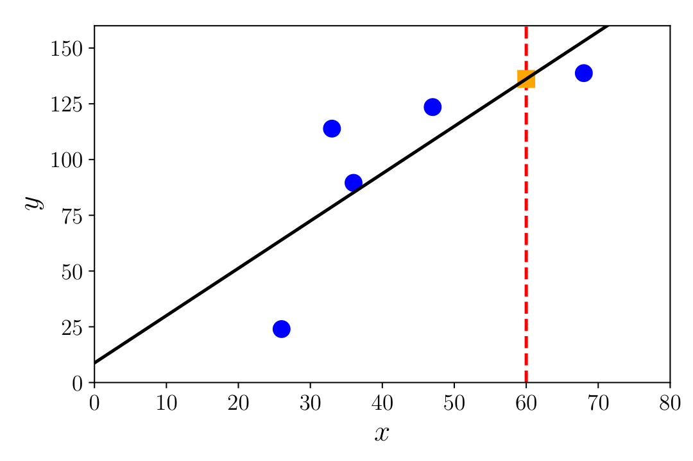
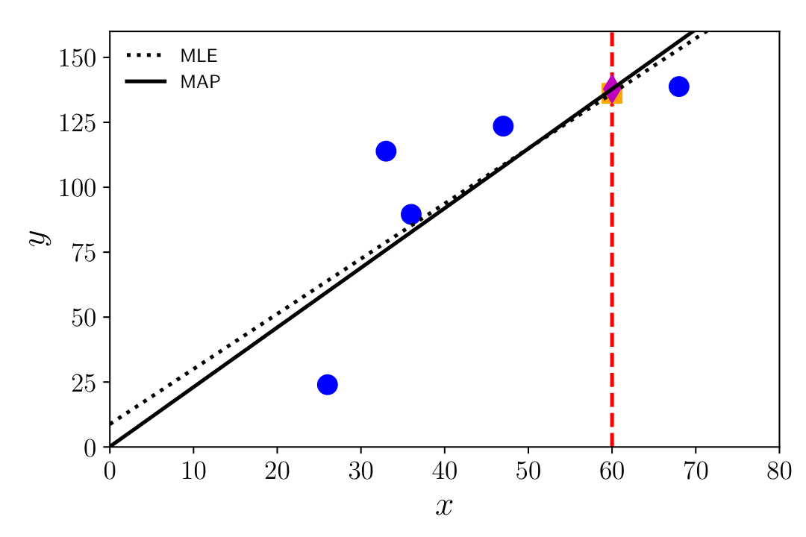
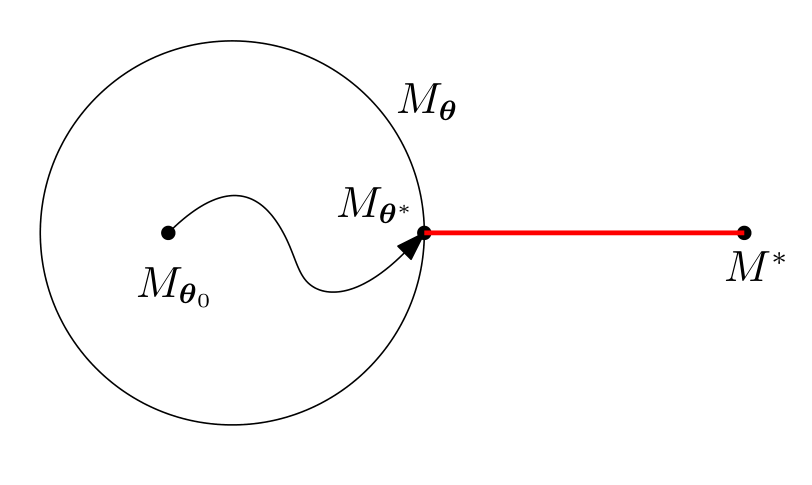
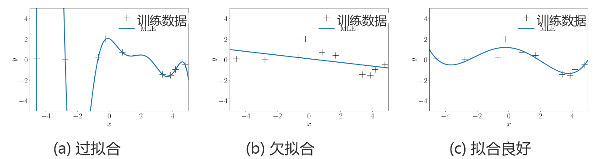

## 8.3 参数估计

在 8.2 节中，我们没有显式地使用概率分布对问题进行建模。在本节中，我们将看到如何利用概率分布对观测过程引起的不确定性以及预测器参数中的不确定性进行建模。在 8.3.1 节中，我们引入似然函数（likelihood），它类似于经验风险最小化中的损失函数概念（8.2.2 节）。先验分布的概念（8.3.2 节）类似于正则化的概念（8.2.3 节）。

---

### 8.3.1 极大似然估计

_极大似然估计（maximum likelihood estimation, MLE）_ 的核心思想是定义一个关于参数的函数，使我们能够找到一个能很好拟合数据的模型。估计问题聚焦于似然函数，更确切地说是其负对数。对于由随机变量 $\boldsymbol{x}$ 表示的数据以及由 $\boldsymbol{\theta}$ 参数化的概率密度族 $p(\boldsymbol{x} \mid \boldsymbol{\theta})$， _负对数似然（negative log-likelihood）_ 由下式给出：

$
L_{\boldsymbol{x}}(\boldsymbol{\theta}) = -\log p(\boldsymbol{x} \mid \boldsymbol{\theta}) .
\tag{8.14}
$

记号 $L_{\boldsymbol{x}}(\boldsymbol{\theta})$ 强调参数 $\boldsymbol{\theta}$ 是变量，而数据 $\boldsymbol{x}$ 是固定的。我们在书写负对数似然时经常省去对 $\boldsymbol{x}$ 的引用，因为它本质上是关于 $\boldsymbol{\theta}$ 的函数；当表示数据不确定性的随机变量在上下文中清晰明确时，我们简记为 $L(\boldsymbol{\theta})$。

让我们解释一下对于固定的 $\boldsymbol{\theta}$ 值，概率密度 $p(\boldsymbol{x} \mid \boldsymbol{\theta})$ 究竟建模了什么。它是一个用于对数据的不确定性建模的分布。换句话说，一旦我们选定了作为预测器的函数类型，似然函数就给出了观测到数据 $\boldsymbol{x}$ 的概率。

从互补的视角来看，如果我们认为数据是固定的（因为它们已经被观测到），而改变参数 $\boldsymbol{\theta}$，那么 $L(\boldsymbol{\theta})$ 告诉了我们什么？它告诉我们对于这组观测 $\boldsymbol{x}$，特定的 $\boldsymbol{\theta}$ 设置有多大的“可能性”（how likely）。基于这第二种视角，极大似然估计器给出了对于该数据集最可能的参数 $\boldsymbol{\theta}$。

我们考虑监督学习设定，其中获取到数据对 $(\boldsymbol{x}_1, y_1), \ldots, (\boldsymbol{x}_N, y_N)$，其中 $\boldsymbol{x}_n \in \mathbb{R}^D$ 且标签 $y_n \in \mathbb{R}$。我们感兴趣的是构建一个预测器，该预测器接收特征向量 $\boldsymbol{x}_n$ 作为输入并产生预测 $y_n$（或接近它的值），即给定向量 $\boldsymbol{x}_n$，我们希望获得标签 $y_n$ 的概率分布。换句话说，我们在特定参数设置 $\boldsymbol{\theta}$ 下指定给定样本时标签的条件概率分布。

#### 例 8.4

常用的第一个例子是指定给定样本时标签的条件概率服从高斯分布。换句话说，我们假设可以用均值为零的独立高斯噪声（参见 6.5 节）$\varepsilon_n \sim \mathcal{N}(0, \sigma^2)$ 来解释观测不确定性。我们进一步假设使用线性模型 $\boldsymbol{x}_n^\top \boldsymbol{\theta}$ 进行预测。这意味着我们为每个“样本-标签”对 $(\boldsymbol{x}_n, y_n)$ 指定一个高斯似然：

$
p(y_n \mid \boldsymbol{x}_n, \boldsymbol{\theta}) = \mathcal{N}\left(y_n \mid \boldsymbol{x}_n^\top \boldsymbol{\theta}, \sigma^2\right) .
\tag{8.15}
$

图 8.3 展示了给定参数 $\boldsymbol{\theta}$ 下的高斯似然示意。我们将在 9.2 节中看到如何根据高斯分布将上述表达式显式展开。

我们假设样本集合 $(\boldsymbol{x}_1, y_1), \ldots, (\boldsymbol{x}_N, y_N)$ 是独立同分布（i.i.d.）的。“独立”（6.4.5 节）意味着整个数据集（$\mathcal{Y} = \{y_1, \ldots, y_N\}$ 与 $\mathcal{X} = \{\boldsymbol{x}_1, \ldots, \boldsymbol{x}_N\}$）的似然可以分解为每个单独样本似然的乘积：

$
p(\mathcal{Y} \mid \mathcal{X}, \boldsymbol{\theta}) = \prod_{n=1}^N p(y_n \mid \boldsymbol{x}_n, \boldsymbol{\theta}) ,
\tag{8.16}
$

其中 $p(y_n \mid \boldsymbol{x}_n, \boldsymbol{\theta})$ 是某个特定分布（在例 8.4 中为高斯分布）。“同分布”意味着式 (8.16) 中乘积的每一项服从相同的分布形式，并且它们共享相同的参数。从优化的角度来看，计算可以分解为较简单函数之和的函数通常更容易。因此，在机器学习中我们经常考虑负对数似然（回想 $\log(ab) = \log(a) + \log(b)$）：

$
L(\boldsymbol{\theta}) = -\log p(\mathcal{Y} \mid \mathcal{X}, \boldsymbol{\theta}) = -\sum_{n=1}^N \log p(y_n \mid \boldsymbol{x}_n, \boldsymbol{\theta}) .
\tag{8.17}
$

虽然在式 (8.15) 的 $p(y_n \mid \boldsymbol{x}_n, \boldsymbol{\theta})$ 中，容易诱人地将位于条件符号右侧的 $\boldsymbol{\theta}$ 解释为已观测且固定的量，但这种理解是不正确的。负对数似然 $L(\boldsymbol{\theta})$ 是关于 $\boldsymbol{\theta}$ 的函数。因此，为了找到一个能够很好解释数据 $(\boldsymbol{x}_1, y_1), \ldots, (\boldsymbol{x}_N, y_N)$ 的优质参数向量 $\boldsymbol{\theta}$，我们关于 $\boldsymbol{\theta}$ 最小化负对数似然 $L(\boldsymbol{\theta})$。

> **备注**  
> 式 (8.17) 中的负号是一个历史沿革的产物：我们通常希望最大化似然，但数值优化文献普遍习惯于研究函数的最小化问题。

#### 例 8.5

继续我们关于高斯似然的例子 (8.15)，负对数似然可以重写为：

$
L(\boldsymbol{\theta}) = -\sum_{n=1}^N \log p(y_n \mid \boldsymbol{x}_n, \boldsymbol{\theta}) = -\sum_{n=1}^N \log \mathcal{N}\left(y_n \mid \boldsymbol{x}_n^\top \boldsymbol{\theta}, \sigma^2\right)
\tag{8.18a}
$

$
= -\sum_{n=1}^N \log \left( \frac{1}{\sqrt{2\pi\sigma^2}} \exp\left( -\frac{(y_n - \boldsymbol{x}_n^\top \boldsymbol{\theta})^2}{2\sigma^2} \right) \right)
\tag{8.18b}
$

$
= -\sum_{n=1}^N \log \exp\left( -\frac{(y_n - \boldsymbol{x}_n^\top \boldsymbol{\theta})^2}{2\sigma^2} \right) - \sum_{n=1}^N \log \frac{1}{\sqrt{2\pi\sigma^2}}
\tag{8.18c}
$

$
= \frac{1}{2\sigma^2} \sum_{n=1}^N (y_n - \boldsymbol{x}_n^\top \boldsymbol{\theta})^2 - \sum_{n=1}^N \log \frac{1}{\sqrt{2\pi\sigma^2}} .
\tag{8.18d}
$

由于 $\sigma$ 是给定的，式 (8.18d) 中的第二项是常数，因此最小化 $L(\boldsymbol{\theta})$ 严格对应于求解第一项所表达的最小二乘问题（与式 (8.8) 比较）。

事实证明，对于高斯似然，对应于极大似然估计的优化问题具有闭式解。我们将在第 9 章中看到更多细节。图 8.5 展示了一个回归数据集以及由极大似然参数所诱导出的函数。类似于未正则化的经验风险最小化（9.2.3 节），极大似然估计也可能遭受过拟合（8.3.3 节）。对于其他似然函数，即如果我们用非高斯分布对噪声进行建模，极大似然估计可能不具备闭式解析解。在这种情况下，我们求助于第 7 章中讨论的数值优化方法。

  
  
<b>图 8.5</b> 对于给定的数据，参数的极大似然估计对应于黑色实面对角线。橙色方块显示了在 x = 60 处的极大似然预测值。

---

### 8.3.2 最大后验估计

如果我们拥有关于参数 $\boldsymbol{\theta}$ 分布的先验知识，我们可以为似然乘上一个附加项。这个附加项就是参数上的先验概率分布 $p(\boldsymbol{\theta})$。对于给定的先验，在观测到某些数据 $\boldsymbol{x}$ 之后，我们应该如何更新 $\boldsymbol{\theta}$ 的分布？换句话说，我们应该如何表示在观测到数据 $\boldsymbol{x}$ 后对 $\boldsymbol{\theta}$ 获得了更具体明确的认知？正如 6.3 节中所讨论的，贝叶斯定理为我们提供了更新随机变量概率分布的规范工具。它允许我们基于一般的先验陈述（ _先验分布_ $p(\boldsymbol{\theta})$）以及连接参数 $\boldsymbol{\theta}$ 与观测数据 $\boldsymbol{x}$ 的函数（称为 _似然_ $p(\boldsymbol{x} \mid \boldsymbol{\theta})$），计算参数 $\boldsymbol{\theta}$ 上的 _后验分布（posterior distribution）_ $p(\boldsymbol{\theta} \mid \boldsymbol{x})$（即更具体明确的知识）：

$
p(\boldsymbol{\theta} \mid \boldsymbol{x}) = \frac{p(\boldsymbol{x} \mid \boldsymbol{\theta}) p(\boldsymbol{\theta})}{p(\boldsymbol{x})} .
\tag{8.19}
$

回想一下，我们感兴趣的是找到最大化后验的参数 $\boldsymbol{\theta}$。由于分布 $p(\boldsymbol{x})$ 不依赖于 $\boldsymbol{\theta}$，因此在优化时我们可以忽略分母的值，从而得到：

$
p(\boldsymbol{\theta} \mid \boldsymbol{x}) \propto p(\boldsymbol{x} \mid \boldsymbol{\theta}) p(\boldsymbol{\theta}) .
\tag{8.20}
$

上述比例关系隐藏了数据本身的概率密度 $p(\boldsymbol{x})$，而该密度可能极难估计。此时，我们不再估计负对数似然的极小值，而是估计负对数后验的极小值，这被称为 _最大后验估计（maximum a posteriori estimation, MAP estimation）_。图 8.6 展示了添加零均值高斯先验的效果。

  
  
<b>图 8.6</b> 比较极大似然估计与最大后验（MAP）估计在 x = 60 处的预测。先验将斜率偏置为更平缓，并将截距偏置为更接近零。在本例中，将截距拉向零的偏置实际上增大了斜率。

#### 例 8.6

除前例中的高斯似然假设外，我们假设参数向量服从零均值的多元高斯分布，即 $p(\boldsymbol{\theta}) = \mathcal{N}(\mathbf{0}, \boldsymbol{\Sigma})$，其中 $\boldsymbol{\Sigma}$ 为协方差矩阵（6.5 节）。注意，高斯分布的共轭先验仍然是高斯分布（6.6.1 节），因此我们期望后验分布同样是一个高斯分布。我们将在第 9 章中看到最大后验估计的详细内容。

在机器学习中，纳入关于良好参数所在位置的先验知识的做法非常普遍。正如我们在 8.2.3 节中所见，另一种视角是正则化的思想，它引入了一个附加项以将得到的参数偏置向原点附近。最大后验估计可以被视为连接非概率世界与概率世界的桥梁，因为它明确承认了对先验分布的需求，但最终仍然只产生参数的一个点估计。

> **备注**  
> 极大似然估计 $\boldsymbol{\theta}_{\text{ML}}$ 具有以下优良性质（Lehmann and Casella, 1998; Efron and Hastie, 2016）：
> - **渐近一致性（Asymptotic consistency）**：在无限多观测的极限下，MLE 收敛于真实值，外加一个近似正态分布的随机误差。
> - 实现这些性质所需的样本量可能相当大。
> - 误差的方差以 $1/N$ 的速度衰减，其中 $N$ 是数据点的数量。
> - 特别是在“小”数据机制下，极大似然估计可能导致严重的过拟合。

极大似然估计原理（以及最大后验估计）利用概率建模来推理数据和模型参数中的不确定性。然而，我们尚未将概率建模的潜力发挥到极致。在本节中，最终得到的训练流程仍然产生预测器的点估计，即训练返回一组代表最佳预测器的单一参数值。在 8.4 节中，我们将采取参数值本身也应被视为随机变量的观点，并在做出预测时利用完整的参数分布，而不是估计该分布的“最佳”单个值。

---

### 8.3.3 模型拟合

考虑给定一个数据集，我们感兴趣的是将一个参数化模型拟合到该数据集上。当我们谈论“拟合”时，通常是指优化/学习模型参数，使它们最小化某个损失函数，例如负对数似然。通过极大似然（8.3.1 节）和最大后验估计（8.3.2 节），我们已经讨论了两种常用于模型拟合的算法。

模型的参数化定义了一个我们可以据此运作的模型类 $\mathcal{M}_{\boldsymbol{\theta}}$。例如，在线性回归设定中，我们可以将输入 $x$ 与（无噪声）观测值 $y$ 之间的关系定义为 $y = ax + b$，其中 $\boldsymbol{\theta} := \{a, b\}$ 为模型参数。在这种情况下，模型参数 $\boldsymbol{\theta}$ 描述了仿射函数族，即斜率为 $a$、偏置截距为 $b$ 的直线族。假设数据来自对我们而言未知的模型 $\mathcal{M}^*$。对于给定的训练数据集，我们优化 $\boldsymbol{\theta}$，使 $\mathcal{M}_{\boldsymbol{\theta}}$ 尽可能接近 $\mathcal{M}^*$，其中“接近程度”由我们优化的目标函数（例如训练数据上的平方损失）来定义。图 8.7 展示了一个场景：我们拥有一个较小的模型类（由圆圈 $\mathcal{M}_{\boldsymbol{\theta}}$ 表示），而数据生成模型 $\mathcal{M}^*$ 位于所考虑的模型集之外。我们从 $\mathcal{M}_{\boldsymbol{\theta}_0}$ 开始参数搜索。在优化之后，即当我们获得最佳可能参数 $\boldsymbol{\theta}^*$ 时，我们区分三种不同的情况：（i）过拟合；（ii）欠拟合；（iii）拟合良好。我们将给出关于这三个概念的高层直觉。

  
  
<b>图 8.7</b> 模型拟合示意。在参数化模型类 Mθ 中，我们优化模型参数 θ 以最小化与真实（未知）模型 M* 之间的距离。

粗略地说， _过拟合（overfitting）_ 是指参数化模型类对于建模由 $\mathcal{M}^*$ 生成的数据集而言过于丰富，即 $\mathcal{M}_{\boldsymbol{\theta}}$ 可以建模复杂得多的数据集。例如，如果数据集是由线性函数生成的，而我们将 $\mathcal{M}_{\boldsymbol{\theta}}$ 定义为七阶多项式类，那么我们不仅可以建模线性函数，还可以建模二次、三次等多项式。过拟合的模型通常具有大量的参数。在实践中检测过拟合的一种方法是在交叉验证期间观察到模型具有较低的训练风险但具有较高的测试风险（8.2.4 节）。我们经常做出的一个观察是，过于灵活的模型类 $\mathcal{M}_{\boldsymbol{\theta}}$ 会倾尽其所有的建模能力来降低训练误差。因此，如果训练数据存在噪声，它甚至会在噪声本身中寻找某些有用的信号。当我们在远离训练数据的地方进行预测时，这将导致巨大的问题。图 8.8(a) 给出了在回归背景下通过极大似然估计学习模型参数时发生过拟合的示例（参见 8.3.1 节）。我们将在 9.2.2 节中进一步讨论回归中的过拟合。

当遇到 _欠拟合（underfitting）_ 是指模型类 $\mathcal{M}_{\boldsymbol{\theta}}$ 不够丰富。例如，如果我们的数据集是由正弦函数生成的，但 $\boldsymbol{\theta}$ 仅能参数化直线，那么无论多么优秀的优化过程都无法使我们接近真实模型。不过，我们仍然可以优化参数并找到建模该数据集的最佳直线。图 8.8(b) 展示了由于灵活性不足而欠拟合的模型示例。欠拟合的模型通常参数很少。

第三种情况是参数化模型类“恰到好处”。此时，我们的模型拟合良好，即它既不过拟合也不欠拟合。这意味着我们的模型类刚好足够丰富以描述所给定的数据集。图 8.8(c) 展示了一个与给定数据集拟合得相当好的模型。理想情况下，这正是我们希望使用的模型类，因为它具有良好的泛化性质。

  
  
<b>图 8.8</b> 不同模型类对回归数据集的拟合结果（通过极大似然）：(a) 过拟合；(b) 欠拟合；(c) 拟合良好。

在实践中，我们经常定义具有海量参数的极其丰富的模型类 $\mathcal{M}_{\boldsymbol{\theta}}$，例如深度神经网络。为了缓解过拟合问题，我们可以使用正则化（8.2.3 节）或先验（8.3.2 节）。我们将在 8.6 节中讨论如何选择模型类。

---

### 8.3.4 延伸阅读

在考虑概率模型时，极大似然估计原理推广了线性模型的最小二乘回归思想，我们将在第 9 章中对其进行详细讨论。当限制预测器为线性形式并对输出应用额外的非线性函数 $\phi$ 时，即：

$
p(y_n \mid \boldsymbol{x}_n, \boldsymbol{\theta}) = \phi(\boldsymbol{\theta}^\top \boldsymbol{x}_n) ,
\tag{8.21}
$

我们可以考虑针对其他预测任务的其他模型，例如二分类或计数数据建模（McCullagh and Nelder, 1989）。对此的另一种视角是考虑来自指数族的似然函数（6.6 节）。这类在参数和数据之间具有线性依赖关系、并具有潜在非线性变换 $\phi$（称为 _连接函数（link function）_）的模型被称为 _广义线性模型（generalized linear models）_（Agresti, 2002, chapter 4）。

极大似然估计历史悠久，最初由 Ronald Fisher 爵士在 20 世纪 30 年代提出。我们将在 8.4 节进一步扩展概率模型的思想。在使用概率模型的研究人员之间，一个长期的争论是贝叶斯统计与频率学派统计之间的讨论。正如 6.1.1 节所述，这归结为对概率本身的定义。回想 6.1 节，我们可以将概率视为逻辑推理的一种推广（通过允许不确定性）（Cheeseman, 1985; Jaynes, 2003）。极大似然估计方法在本质上属于频率学派，感兴趣的读者可参阅 Efron and Hastie (2016)，以获得对贝叶斯和频率学派统计的客观均衡视角。

对于某些概率模型，极大似然估计可能并不可行。读者可参阅更高级的统计学教材（例如 Casella and Berger, 2002），了解矩估计（method of moments）、M-估计（M-estimation）以及估计方程（estimating equations）等方法。
