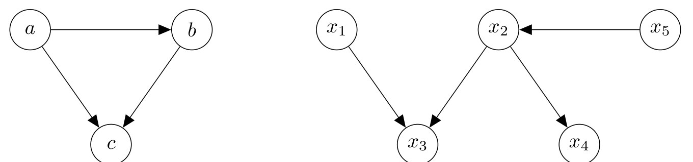
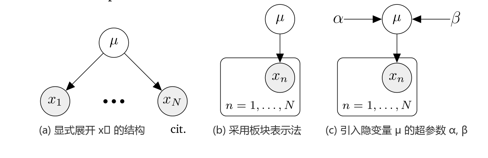
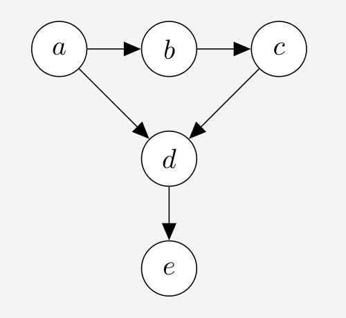
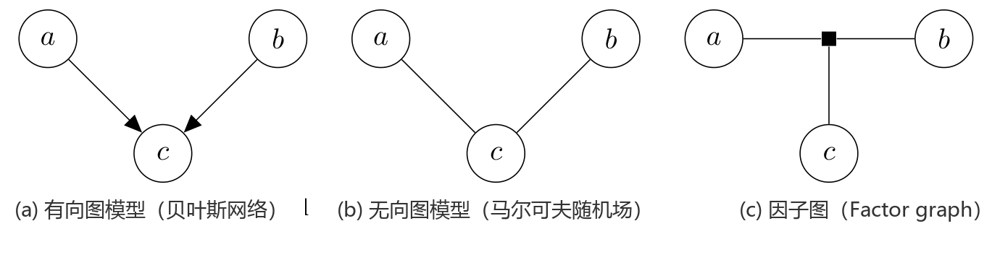

## 8.5 有向图模型

在本节中，我们介绍一种用于指定概率模型的图语言，称为 _有向图模型（directed graphical model）_。它提供了一种紧凑且简洁的方式来定义概率模型，并允许读者直观地解析随机变量之间的依赖关系。图模型直观地捕捉了所有随机变量上的联合分布如何分解为仅依赖于这些变量子集的因子乘积。在 8.4 节中，我们将概率模型的联合分布确定为核心关注量，因为它包含了关于先验、似然和后验的全部信息。然而，联合分布本身可能极其复杂，并且它无法直接向我们揭示概率模型的结构性质。例如，联合分布 $p(a, b, c)$ 本身并不能直观告诉我们变量之间的任何独立性关系。这正是图模型发挥作用之处。本节依赖于 6.4.5 节中描述的独立性与条件独立性概念。

在图模型中，节点代表随机变量。在图 8.9(a) 中，节点分别表示随机变量 $a, b, c$。边代表变量之间的概率关系，例如条件概率。有向图模型也被称为 _贝叶斯网络（Bayesian networks）_。

> **备注**  
> 并非任何分布都可以由特定选取的图模型精确表示。对此的深入讨论可参见 Bishop (2006)。

概率图模型具有许多极为便利的性质：
- 它们提供了一种直观可视化概率模型结构的简单方式。
- 它们可用于设计或启发新型统计模型。
- 仅通过检查图的拓扑结构，就能深入洞察模型的代数性质，例如条件独立性。
- 统计模型中用于推断和学习的复杂计算，可以通过图上的局部操作（消息传递）直观表达。

---

### 8.5.1 图语义

有向图模型（贝叶斯网络）是一种表示概率模型中条件依赖关系的方法。它们提供了条件概率的可视化描述，从而为描述复杂的相互依赖关系提供了一种简单的语言。在附加假设下，有向箭头还可用于表示因果关系（Pearl, 2009）。这种模块化描述还带来了计算上的大幅简化。两个节点（随机变量）之间的有向连接（箭头）表示条件概率。例如，图 8.9(a) 中 $a$ 和 $b$ 之间的箭头表示给定 $a$ 时 $b$ 的条件概率 $p(b \mid a)$。

  
  
<b>图 8.9</b> 有向图模型示例：(a) 完全连接的有向图模型；(b) 非完全连接的有向图模型。

如果我们了解联合分布因式分解的某些性质，就可以直接从联合分布推导出对应的有向图模型。

#### 例 8.7

考虑三个随机变量 $a, b, c$ 的联合分布：

$
p(a, b, c) = p(c \mid a, b) p(b \mid a) p(a) .
\tag{8.29}
$

式 (8.29) 中联合分布的因式分解向我们揭示了随机变量之间的层级关系：
- $c$ 直接依赖于 $a$ 和 $b$。
- $b$ 直接依赖于 $a$。
- $a$ 既不依赖于 $b$，也不依赖于 $c$。

对于式 (8.29) 的因式分解，我们得到图 8.9(a) 所示的有向图模型。

一般而言，我们可以按照如下步骤从因式分解的联合分布构建对应的有向图模型：
1. 为所有随机变量分别创建一个节点。
2. 对于每个条件分布，从其所依据的条件变量所对应的节点出发，向该条件分布对应的变量节点添加一条有向边（箭头）。

图的布局结构取决于联合分布因式分解的具体方式。

我们讨论了如何从已知的联合分布因式分解得到对应的有向图模型。现在，我们执行完全相反的操作：描述如何从给定的图模型中提取一组随机变量的联合分布。

#### 例 8.8

考察图 8.9(b) 所示的图模型，我们利用两条基本性质：
1. 我们寻求的联合分布 $p(x_1, \ldots, x_5)$ 是图中每个节点对应条件分布的乘积。在这个特定示例中，我们需要五个条件分布。
2. 每个条件分布仅依赖于图中对应节点的 _父节点（parents）_。例如，$x_4$ 的条件仅取决于 $x_2$。

这两条性质给出了联合分布所需的因式分解：

$
p(x_1, x_2, x_3, x_4, x_5) = p(x_1) p(x_5) p(x_2 \mid x_5) p(x_3 \mid x_1, x_2) p(x_4 \mid x_2) .
\tag{8.30}
$

一般而言，联合分布 $p(\boldsymbol{x}) = p(x_1, \ldots, x_K)$ 由下式给出：

$
p(\boldsymbol{x}) = \prod_{k=1}^K p\left(x_k \mid \text{Pa}_k\right) ,
\tag{8.31}
$

其中 $\text{Pa}_k$ 表示“$x_k$ 的父节点集合”。$x_k$ 的父节点是指有箭头直接指向 $x_k$ 的所有节点。

我们以抛硬币实验的具体示例来结束本小节。考虑一个伯努利实验（例 6.8），其中该实验结果 $x$ 为“正面”的概率为：

$
p(x \mid \mu) = \text{Ber}(\mu) .
\tag{8.32}
$

我们现在将该实验重复 $N$ 次并观测到结果 $x_1, \ldots, x_N$，从而获得联合分布：

$
p(x_1, \ldots, x_N \mid \mu) = \prod_{n=1}^N p(x_n \mid \mu) .
\tag{8.33}
$

右侧的表达式是每个单独结果的伯努利分布的乘积，因为每次实验是独立的。回想 6.4.5 节，统计独立性意味着分布可以因式分解。为了写出该设定的图模型，我们对未观测/隐变量与已观测变量进行区分。在图示中，已观测变量由阴影节点表示，从而得到图 8.10(a) 中的图模型。我们看到，由于结果 $x_n$ 是同分布的，单一参数 $\mu$ 对所有 $x_n$（$n = 1, \ldots, N$）都是相同的。针对该设定的一种更紧凑但完全等价的图模型如图 8.10(b) 所示，其中我们使用了 _板块表示法（plate notation）_。板块（矩形框）将内部的所有内容（在此例中为观测值 $x_n$）重复 $N$ 次。因此，这两个图模型是等价的，但板块表示法紧凑得多。

  
  
<b>图 8.10</b> 重复伯努利实验的图模型：(a) 显式展开 xₙ 的结构；(b) 采用板块表示法；(c) 引入隐变量 μ 上的超参数 α 和 β。

图模型允许我们直接在 $\mu$ 上设置 _超先验（hyperprior）_。超先验是针对第一层先验参数设立的第二层先验分布。图 8.10(c) 在隐变量 $\mu$ 上引入了 $\text{Beta}(\alpha, \beta)$ 先验。如果我们将 $\alpha$ 和 $\beta$ 视为确定性参数（即非随机变量），我们通常省略其外侧的圆圈。

---

### 8.5.2 条件独立性与 d-分离

有向图模型允许我们仅仅通过观察图的拓扑结构来确定联合分布的条件独立性（6.4.5 节）性质。被称为 _d-分离（d-separation）_（Pearl, 1988）的概念是这一分析的关键。

考虑一个一般的有向图，其中 $A, B, C$ 是互不相交的任意节点子集（它们的并集可以小于图中节点的完整集合）。我们希望确定给定的有向无环图是否蕴含特定的条件独立性陈述：“在给定 $C$ 的条件下，$A$ 与 $B$ 条件独立”，记作：

$
A \perp\perp B \mid C .
\tag{8.34}
$

为此，我们考虑从集合 $A$ 中的任意节点到集合 $B$ 中的任意节点的所有可能无向轨迹（忽略箭头方向的路径）。如果任何此类路径包含满足以下任一条件的节点，则称该路径被 _阻断（blocked）_：
1. 路径上的箭头在该节点处相遇形式为“头对尾”（head-to-tail）或“尾对尾”（tail-to-tail），并且该节点位于集合 $C$ 中。
2. 路径上的箭头在该节点处相遇形式为“头对头”（head-to-head），并且该节点及其所有后代节点均不在集合 $C$ 中。

如果连接 $A$ 与 $B$ 的所有可能路径都被阻断，则称集合 $A$ 在给定 $C$ 的条件下与集合 $B$ 实现了 _d-分离（d-separation）_，并且图中所有变量上的联合分布都将严格满足 $A \perp\perp B \mid C$。

  
  
<b>图 8.11</b> d-分离示例图模型。

#### 例 8.9（条件独立性）

考虑图 8.11 所示的图模型。直观检查拓扑结构可得：

$
b \perp\perp d \mid a, c
\tag{8.35}
$

$
a \perp\perp c \mid b
\tag{8.36}
$

$
b \not\perp\perp d \mid c
\tag{8.37}
$

$
a \not\perp\perp c \mid b, e
\tag{8.38}
$

有向图模型允许对概率模型进行高度紧凑的表示，我们将在第 9、10 和 11 章中看到有向图模型的广泛应用。该表示形式结合条件独立性概念，使我们能够将各自的概率模型因式分解为更易于优化的局部表达式。

概率模型的图表示使我们能够直观地看到我们在模型结构上所做出的设计选择的影响。我们经常需要对模型的结构做出高层次的假设。这些建模假设（超参数）会影响预测性能，但无法直接使用我们目前所看到的方法进行选取。我们将在 8.6 节中讨论选择模型结构的不同方法。

---

### 8.5.3 延伸阅读

关于概率图模型的导论可参阅 Bishop (2006, 第 8 章)，关于各种应用及相应算法影响的详尽阐述可参阅 Koller and Friedman (2009) 的经典著作。概率图模型主要有三种基本类型：
1. **有向图模型（贝叶斯网络）**；参见图 8.12(a)。
2. **无向图模型（马尔可夫随机场）**；参见图 8.12(b)。
3. **因子图（Factor graphs）**；参见图 8.12(c)。

  
  
<b>图 8.12</b> 三种类型的图模型：(a) 有向图模型（贝叶斯网络）；(b) 无向图模型（马尔可夫随机场）；(c) 因子图。

图模型允许利用基于图的算法进行推断和学习，例如通过局部消息传递（local message passing）。其应用范围涵盖在线游戏排位（Herbrich et al., 2007）、计算机视觉（例如图像分割、语义标注、图像去噪、图像复原（Kittler and Föglein, 1984; Sucar and Gillies, 1994; Shotton et al., 2006; Szeliski et al., 2008））、编码理论（McEliece et al., 1998）、线性方程组求解（Shental et al., 2008）以及信号处理中的迭代贝叶斯状态估计（Bickson et al., 2007; Deisenroth and Mohamed, 2012）。

在实际应用中极其重要但在本书中未深入探讨的一个主题是 _结构化预测（structured prediction）_（Bakir et al., 2007; Nowozin et al., 2014），它使机器学习模型能够处理序列、树和图等具有内部结构的预测任务。神经网络模型的普及催生了更灵活的概率模型，产生了结构化模型的诸多成功应用（Goodfellow et al., 2016, 第 16 章）。近年来，由于图模型在因果推断中的重要应用，人们对图模型重新燃起了浓厚兴趣（Pearl, 2009; Imbens and Rubin, 2015; Peters et al., 2017; Rosenbaum, 2017）。
