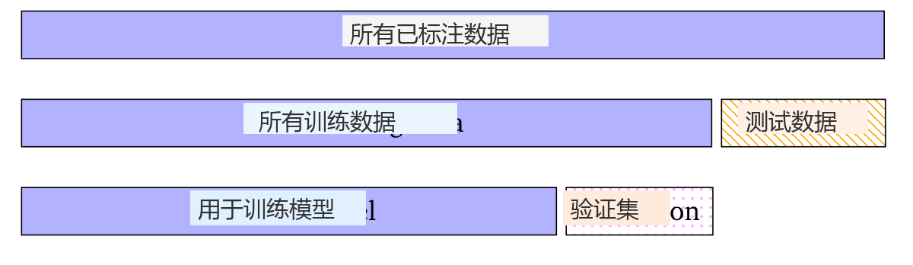
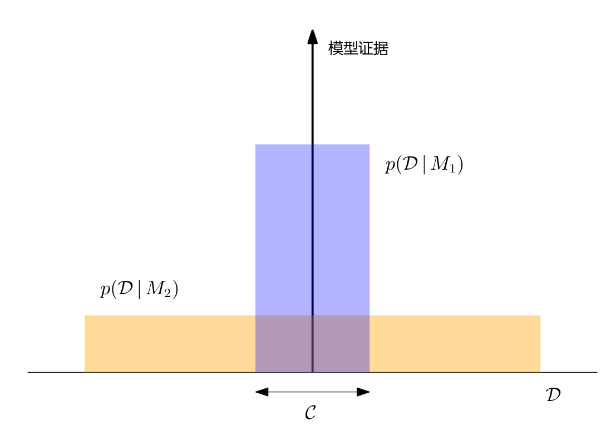
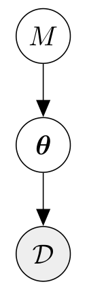

## 8.6 模型选择

在机器学习中，我们经常需要做出对模型性能产生决定性影响的高层次建模决策。我们所做的选择（例如似然函数的函数形式）直接影响模型中自由参数的数量和类型，从而也决定了模型的灵活性与表达能力。更复杂的模型在能够描述更多数据集的意义上更为灵活。例如，1 次多项式（直线 $y = a_0 + a_1 x$）只能用于描述输入 $x$ 与观测值 $y$ 之间的线性关系。而 2 次多项式（$y = a_0 + a_1 x + a_2 x^2$）通过令 $a_2 = 0$ 也可以描述线性函数，即它在表达能力上严格强于 1 次多项式，并且能够额外描述输入与观测值之间的二次曲线关系。

人们可能会认为，非常灵活的模型由于表达能力更强，因而通常比简单模型更具优势。然而，一个普遍的问题在于，在训练阶段我们只能使用训练集来评估模型的性能并学习其参数。但我们在训练集上的表现并非我们真正关注的目标。在 8.3 节中，我们已经看到极大似然估计可能导致严重的过拟合，特别是在训练数据集较小的情况下。在理想情况下，我们的模型（也）应当在测试集（在训练时不可见）上表现良好。因此，我们需要某种机制来评估模型如何泛化到未见过的测试数据。 _模型选择（model selection）_ 所关注的正是这个问题。

---

### 8.6.1 嵌套交叉验证

我们已经见识过一种可用于模型选择的方法（8.2.4 节中的交叉验证）。回想一下，交叉验证通过重复将数据集划分为训练集和验证集来提供泛化误差的估计。我们可以将这一思想再次应用，即对于每次划分，我们再执行另一轮交叉验证。这被称为 _嵌套交叉验证（nested cross-validation）_ ；参见图 8.13。

  
  
<b>图 8.13</b> 嵌套交叉验证示意。我们执行两级 K 折交叉验证。

内层循环用于在内部验证集上评估特定模型或超参数选择的性能。外层循环用于评估由内层循环挑选出的最佳模型的泛化性能。我们可以在内层循环中测试不同的模型和超参数选择。为了区分这两个层级，通常将用于估计泛化性能的集合称为 _测试集（test set）_ ，而将用于选择最佳模型的集合称为 _ 验证集（validation set）_ 。内层循环通过使用验证集上的经验误差进行近似，来估计给定模型的泛化误差期望值：

$$
\mathbb{E}_{\mathcal{V}}[R(\mathcal{V} \mid \mathcal{M})] \approx \frac{1}{K} \sum_{k=1}^K R(\mathcal{V}^{(k)} \mid \mathcal{M}) ,
\tag{8.39}
$$

其中 $R(\mathcal{V} \mid \mathcal{M})$ 是模型 $\mathcal{M}$ 在验证集 $\mathcal{V}$ 上的经验风险（例如均方根误差 RMSE）。标准误差定义为 $\sigma / \sqrt{K}$，其中 $K$ 是实验次数，$\sigma$ 是每次实验风险的标准差。我们对所有备选模型重复此过程，并选择表现最佳的模型。请注意，交叉验证不仅为我们提供了期望泛化误差，我们还可以获得更高阶的统计量（例如标准误差），即均值估计不确定性的度量。一旦确定了最终模型，我们就可以在保留的测试集上评估最终的泛化性能。

---

### 8.6.2 贝叶斯模型选择

模型选择有许多方法，本节将介绍其中一部分。通常，它们都试图在模型复杂度与数据拟合程度之间进行权衡。我们假设简单模型比复杂模型更不容易发生过拟合，因此模型选择的目标是寻找能够合理解释数据的最简单模型。这一概念被称为 _奥卡姆剃刀（Occam's razor）_ 。

> **备注**  
> 如果我们将模型选择视为假设检验问题，我们寻求的是与数据一致的最简单假设（Murphy, 2012）。

人们可能会考虑在模型上设置一个偏好较简单模型的先验。然而，这样做并非必须：在贝叶斯概率的应用中，已经从数量上自然蕴含了“自动奥卡姆剃刀”（automatic Occam's razor）（Smith and Spiegelhalter, 1980; Jefferys and Berger, 1992; MacKay, 1992）。图 8.14（改编自 MacKay, 2003）给出了为什么复杂且高表达力的模型对建模给定数据集 $\mathcal{D}$ 而言反而可能是概率较低之选择的基本直觉。

  
  
<b>图 8.14</b> 贝叶斯推断体现了奥卡姆剃刀。横轴表示所有可能数据集 D 的空间。模型证据（纵轴）评估模型预测可用数据的能力。由于 p(D | Mᵢ) 对所有可能数据集积分必须为 1，我们应当选择模型证据最大的模型。（改编自 MacKay, 2003）

让我们将横轴想象为所有可能数据集 $\mathcal{D}$ 的空间。如果我们感兴趣的是在给定数据 $\mathcal{D}$ 的条件下模型 $\mathcal{M}_i$ 的后验概率 $p(\mathcal{M}_i \mid \mathcal{D})$，我们可以应用贝叶斯定理。假设在所有模型上具有均匀先验 $p(\mathcal{M})$，贝叶斯定理按照模型预测实际发生数据的能力成比例地奖励模型。给定模型 $\mathcal{M}_i$ 时数据的这种预测概率 $p(\mathcal{D} \mid \mathcal{M}_i)$ 被称为 $\mathcal{M}_i$ 的 _模型证据（evidence）_ 。简单模型 $\mathcal{M}_1$ 只能预测一小部分数据集，如 $p(\mathcal{D} \mid \mathcal{M}_1)$ 所示；而具有更多自由参数的更强大模型 $\mathcal{M}_2$ 能够预测种类更多样的数据集。这些预测由 $\mathcal{D}$ 上的归一化概率分布量化，即对所有可能数据积分或求和必须等于 1。这意味着，$\mathcal{M}_2$ 对区域 $C$ 内的数据集的预测能力不如 $\mathcal{M}_1$ 集中。假设为这两个模型分配了相等的先验概率，那么如果数据集落在区域 $C$ 内，表达能力较弱的模型 $\mathcal{M}_1$ 反而是后验概率更高的模型。

在本章早些时候，我们指出模型需要能够解释数据，即应当存在从给定模型生成数据的方法。此外，如果模型已经从数据中进行了适度学习，那么我们期望生成的数据应当与经验观测数据相似。为此，将模型选择表述为分层推断问题是很有帮助的，这使我们能够计算模型集合上的后验分布。

考虑有限个模型构成的集合 $\mathcal{M} = \{\mathcal{M}_1, \ldots, \mathcal{M}_K\}$，其中每个模型 $\mathcal{M}_k$ 具有参数 $\boldsymbol{\theta}_k$。在贝叶斯模型选择中，我们在模型集合上引入先验分布 $p(\mathcal{M})$。允许我们从该模型生成数据的对应生成过程为：

$$
\mathcal{M}_k \sim p(\mathcal{M})
\tag{8.40}
$$

$$
\boldsymbol{\theta}_k \sim p(\boldsymbol{\theta} \mid \mathcal{M}_k)
\tag{8.41}
$$

$$
\mathcal{D} \sim p(\mathcal{D} \mid \boldsymbol{\theta}_k)
\tag{8.42}
$$

该层级生成过程如图 8.15 所示。

  
  
<b>图 8.15</b> 贝叶斯模型选择中的层级生成过程图示。我们在模型集上引入先验 p(M)。对于每个模型，其对应模型参数具有分布 p(θ | M)，该分布进而用于生成观测数据 D。

给定训练集 $\mathcal{D}$，我们应用贝叶斯定理并计算模型上的后验分布：

$$
p(\mathcal{M}_k \mid \mathcal{D}) \propto p(\mathcal{M}_k) p(\mathcal{D} \mid \mathcal{M}_k) .
\tag{8.43}
$$

请注意，该后验不再依赖于模型参数 $\boldsymbol{\theta}_k$，因为在贝叶斯框架下参数已被积分消除：

$$
p(\mathcal{D} \mid \mathcal{M}_k) = \int p(\mathcal{D} \mid \boldsymbol{\theta}_k) p(\boldsymbol{\theta}_k \mid \mathcal{M}_k) d\boldsymbol{\theta}_k ,
\tag{8.44}
$$

其中 $p(\boldsymbol{\theta}_k \mid \mathcal{M}_k)$ 是模型 $\mathcal{M}_k$ 的模型参数 $\boldsymbol{\theta}_k$ 的先验分布。式 (8.44) 被称为 _模型证据（model evidence）_ 或 _ 边缘似然（marginal likelihood）_ 。根据式 (8.43) 中的后验分布，我们确定 MAP 估计：

$$
\mathcal{M}^* = \arg\max_{\mathcal{M}_k} p(\mathcal{M}_k \mid \mathcal{D}) .
\tag{8.45}
$$

若采用均匀先验 $p(\mathcal{M}_k) = \frac{1}{K}$（赋予每个模型相等的先验概率），在模型上确定 MAP 估计等价于选取最大化模型证据 (8.44) 的模型。

> **备注（似然与边缘似然）**  
> 似然与边缘似然（模型证据）之间存在一些重要差异：虽然似然容易出现过拟合，但边缘似然通常不会，因为模型参数已经被边缘化积分消除（即我们不再需要拟合参数）。此外，边缘似然自动体现了模型复杂度与数据拟合之间的权衡（奥卡姆剃刀）。

---

### 8.6.3 用于模型比较的贝叶斯因子

考虑在给定数据集 $\mathcal{D}$ 的情况下比较两个概率模型 $\mathcal{M}_1, \mathcal{M}_2$ 的问题。如果我们计算后验概率 $p(\mathcal{M}_1 \mid \mathcal{D})$ 和 $p(\mathcal{M}_2 \mid \mathcal{D})$，我们可以计算后验概率之比：

$$
\underbrace{\frac{p(\mathcal{M}_1 \mid \mathcal{D})}{p(\mathcal{M}_2 \mid \mathcal{D})}}_{\text{后验几率}} = \frac{\frac{p(\mathcal{D} \mid \mathcal{M}_1) p(\mathcal{M}_1)}{p(\mathcal{D})}}{\frac{p(\mathcal{D} \mid \mathcal{M}_2) p(\mathcal{M}_2)}{p(\mathcal{D})}} = \underbrace{\frac{p(\mathcal{M}_1)}{p(\mathcal{M}_2)}}_{\text{先验几率}} \underbrace{\frac{p(\mathcal{D} \mid \mathcal{M}_1)}{p(\mathcal{D} \mid \mathcal{M}_2)}}_{\text{贝叶斯因子}} .
\tag{8.46}
$$

后验的比值被称为 _后验几率（posterior odds）_ 。式 (8.46) 等号右侧的第一个分式为 _ 先验几率（prior odds）_ ，度量了我们的先验信念在多大程度上偏向 $\mathcal{M}_1$ 胜过 $\mathcal{M}_2$。边缘似然的比值（右侧第二个分式）被称为 _贝叶斯因子（Bayes factor）_ ，度量了与 $\mathcal{M}_2$ 相比，模型 $\mathcal{M}_1$ 预测数据 $\mathcal{D}$ 的优良程度。

> **备注**  
> _杰弗里斯-林德利悖论（Jeffreys-Lindley paradox）_ 指出，“贝叶斯因子总是偏向于更简单的模型，因为在具有弥散先验的复杂模型下，数据的边缘概率将非常小”（Murphy, 2012）。这里的“弥散先验”（diffuse prior）是指不偏向任何特定模型的先验，即在该先验下许多模型在先验上都是合理的。

如果我们选择模型上的均匀先验，式 (8.46) 中的先验几率项为 1，即后验几率等于边缘似然之比（贝叶斯因子）：

$$
\frac{p(\mathcal{D} \mid \mathcal{M}_1)}{p(\mathcal{D} \mid \mathcal{M}_2)} .
\tag{8.47}
$$

如果贝叶斯因子大于 1，我们选择模型 $\mathcal{M}_1$；否则选择模型 $\mathcal{M}_2$。与频率学派统计类似，在认定结果具有“统计显著性”之前，对于该比值的大小存在一些参考指南（Jeffreys, 1961）。

> **备注（计算边缘似然）**  
> 边缘似然在模型选择中发挥着核心作用：我们需要计算贝叶斯因子 (8.46) 以及模型上的后验分布 (8.43)。  
> 遗憾的是，计算边缘似然需要我们求解积分 (8.44)。该积分在通常情况下解析不可积，我们将不得不求助于近似技术，例如数值积分（Stoer and Burlirsch, 2002）、利用蒙特卡洛的随机近似（Murphy, 2012）或贝叶斯蒙特卡洛技术（O'Hagan, 1991; Rasmussen and Ghahramani, 2003）。  
> 然而，存在一些可以精确求解的特例。在 6.6.1 节中，我们讨论了共轭模型。如果我们选择共轭参数先验 $p(\boldsymbol{\theta})$，我们就可以闭式计算边缘似然。在第 9 章中，我们将在正规线性回归的背景下严格实现这一点。

在本章中，我们简要介绍了机器学习的基本概念。在本书第二部分的其余章节中，我们将看到 8.2 节、8.3 节和 8.4 节中的三种不同学习风格如何全面应用于机器学习的四大支柱（回归、降维、密度估计和分类）。

---

### 8.6.4 延伸阅读

我们在本节开头提到，存在影响模型性能的高层建模决策。典型的选择包括：
- 回归设定中多项式的阶数
- 混合模型中成分的数量
- （深度）神经网络的网络架构
- 支持向量机中核函数的类型
- PCA 中潜空间的维度
- 优化算法中的学习率（及衰减计划）

在参数模型中，参数数量通常与模型类的复杂度直接相关。Rasmussen and Ghahramani (2001) 指出，自动奥卡姆剃刀不一定会简单惩罚模型中参数的数量，而是从函数复杂度的角度发挥作用。他们还证明，自动奥卡姆剃刀同样适用于具有无限参数的贝叶斯非参数模型（例如高斯过程）。

如果我们聚焦于极大似然估计，存在若干抑制过拟合的模型选择启发式准则。它们被称为 _信息准则（information criteria）_ ，我们选择具有最大准则值的模型：

1. **赤池信息准则（Akaike Information Criterion, AIC）**（Akaike, 1974）：

$$
\log p(\boldsymbol{x} \mid \boldsymbol{\theta}) - M
\tag{8.48}
$$

通过添加一个惩罚项来修正极大似然估计器的偏差，以补偿具有大量参数的复杂模型的过拟合。这里 $M$ 是模型参数的数量。AIC 估计了给定模型所损失的相对信息量。

2. **贝叶斯信息准则（Bayesian Information Criterion, BIC）**（Schwarz, 1978）：

$$
\log p(\boldsymbol{x}) = \log \int p(\boldsymbol{x} \mid \boldsymbol{\theta}) p(\boldsymbol{\theta}) d\boldsymbol{\theta} \approx \log p(\boldsymbol{x} \mid \boldsymbol{\theta}) - \frac{1}{2} M \log N
\tag{8.49}
$$

可用于指数族分布。这里 $N$ 是数据点的数量，$M$ 是参数的数量。相比于 AIC，BIC 对模型复杂度的惩罚要严厉得多。
