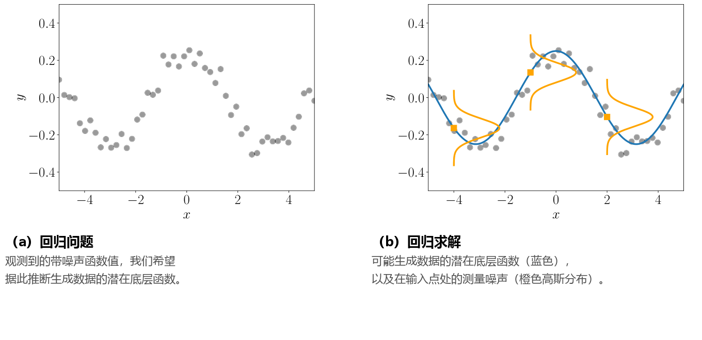

# 9 线性回归

在接下来的内容中，我们将运用第 2、5、6 和 7 章中的数学概念来解决 _线性回归（linear regression）_ （曲线拟合）问题。在回归中，我们的目标是寻找一个函数 $f$，将输入 $\boldsymbol{x} \in \mathbb{R}^D$ 映射到对应的函数值 $f(\boldsymbol{x}) \in \mathbb{R}$。我们假设给定一组训练输入 $\boldsymbol{x}_n$ 以及对应的带噪声观测值 $y_n = f(\boldsymbol{x}_n) + \epsilon$，其中 $\epsilon$ 是描述测量/观测噪声以及潜在未建模过程（在本章中我们不对此做进一步探讨）的独立同分布（i.i.d.）随机变量。贯穿本章，我们均假设噪声为零均值高斯噪声。我们的任务是找到一个函数，它不仅能够很好地拟合训练数据，而且能够很好地泛化到不属于训练数据的输入位置，对那里的函数值做出准确预测（参见第 8 章）。

图 9.1 对这类回归问题进行了直观图解。图 9.1(a) 展示了一个典型的回归场景：对于某些输入值 $\boldsymbol{x}_n$，我们观测到（带噪声的）函数值 $y_n = f(\boldsymbol{x}_n) + \epsilon$。任务是推断出生成这些数据且对新输入位置具有良好泛化能力的函数 $f$。图 9.1(b) 给出了一个可能的解，其中还展示了以函数值 $f(\boldsymbol{x})$ 为中心的三个分布，它们代表了数据中存在的测量噪声。

  
  
<b>图 9.1</b> (a) 数据集；(b) 回归问题的一个可能解。

回归是机器学习中的一个基础核心问题，广泛出现在多种研究领域与实际应用中，包括时间序列分析（如系统辨识）、控制与机器人学（如强化学习、正向/逆向模型学习）、连续优化（如线搜索、全局优化）以及深度学习应用（如计算机游戏、语音转文字、图像识别、视频自动标注等）。回归也是许多分类算法的关键组成部分。寻找一个满意的回归函数需要解决一系列问题，主要包括以下几个方面：

1. **模型（类型）的选择与回归函数的参数化**：给定数据集，哪些函数类（例如多项式）适合用于对数据进行建模？我们应当选择哪种具体的参数化形式（例如多项式的阶数）？正如 8.6 节所讨论的， _模型选择（model selection）_ 允许我们比较不同的模型，从而找到能够合理解释训练数据的最简模型。通常，噪声类型的选择也属于“模型选择”的范畴，但在本章中我们将噪声固定为高斯噪声。
2. **寻找优良参数**：选定回归函数的模型后，我们如何寻找优良的模型参数？在此，我们需要考察不同的损失/目标函数（它们定义了何为“拟合得好”）以及能够最小化该损失的优化算法。
3. **过拟合与模型选择**：当回归函数拟合训练数据“过好”，却无法泛化到未见过的测试数据时，就会发生 _过拟合（overfitting）_ 。当底层模型（或其参数化）过于灵活和表达能力过强时，通常会发生过拟合（见 8.6 节）。我们将探究其底层成因，并讨论在线性回归背景下缓解过拟合效应的途径。
4. **损失函数与参数先验之间的联系**：损失函数（优化目标）通常由概率模型激发并导出。我们将探讨优化损失函数与导出这些损失的底层先验假设之间的深刻对应关系。
5. **不确定性建模**：在任何实际应用中，我们都只能利用有限（尽管可能很大）的训练数据来选择模型类及相应参数。鉴于这些有限的训练数据不可能涵盖所有可能的情景，我们可能希望描述残留的参数不确定性，从而获得模型在测试阶段预测结果的置信度量；训练集越小，不确定性建模就越重要。自洽严谨的不确定性建模赋予了模型预测以置信区间。

在接下来的各节中，我们将系统运用第 3、5、6 和 7 章的数学工具来解决线性回归问题：
- 在 9.1 节中形式化问题表述；
- 在 9.2 节中讨论用于寻找最优模型参数的极大似然估计（MLE）与最大后验估计（MAP），并简要剖析泛化误差与过拟合现象；
- 在 9.3 节中介绍贝叶斯线性回归（Bayesian linear regression），它允许我们在更高层次上对模型参数进行概率推理，从而消除极大似然和 MAP 估计中所遇到的一些固有缺陷；
- 在 9.4 节中从几何角度将极大似然解阐释为正交投影；
- 在 9.5 节中提供延伸阅读建议。
