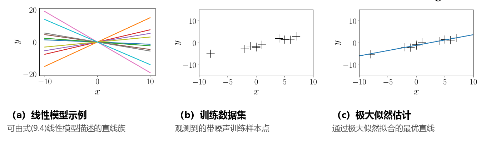

## 9.1 问题表述

由于观测噪声的存在，我们将采用概率方法，并通过似然函数对噪声进行显式建模。更具体地说，贯穿本章，我们考虑具有如下似然函数的回归问题：

$$
p(y \mid \boldsymbol{x}) = \mathcal{N}\left(y \mid f(\boldsymbol{x}), \sigma^2\right) .
\tag{9.1}
$$

这里，$\boldsymbol{x} \in \mathbb{R}^D$ 为输入，$y \in \mathbb{R}$ 为带噪声的函数值（目标标签）。由式 (9.1)，$\boldsymbol{x}$ 与 $y$ 之间的函数关系可以表示为：

$$
y = f(\boldsymbol{x}) + \epsilon ,
\tag{9.2}
$$

其中 $\epsilon \sim \mathcal{N}(0, \sigma^2)$ 是均值为 0、方差为 $\sigma^2$ 的独立同分布（i.i.d.）高斯测量噪声。我们的目标是找到一个与生成数据的未知底层函数 $f$ 接近（相似）且泛化能力良好的函数。

在本章中，我们重点关注 _参数化模型（parametric models）_ ，即选择一个参数化函数，并寻找能够“良好运作”以对数据进行建模的参数 $\boldsymbol{\theta}$。目前，我们假设噪声方差 $\sigma^2$ 是已知的，并专注于学习模型参数 $\boldsymbol{\theta}$。在 _线性回归（linear regression）_ 中，我们考虑参数 $\boldsymbol{\theta}$ 在模型中线性出现的特殊情况。线性回归的一个基础示例由下式给出：

$$
p(y \mid \boldsymbol{x}, \boldsymbol{\theta}) = \mathcal{N}\left(y \mid \boldsymbol{x}^\top \boldsymbol{\theta}, \sigma^2\right)
\tag{9.3}
$$

$$
\iff y = \boldsymbol{x}^\top \boldsymbol{\theta} + \epsilon , \quad \epsilon \sim \mathcal{N}(0, \sigma^2) ,
\tag{9.4}
$$

其中 $\boldsymbol{\theta} \in \mathbb{R}^D$ 是我们要求解的参数。由式 (9.4) 描述的函数类是通过原点的直线。在式 (9.4) 中，我们选择了参数化形式 $f(\boldsymbol{x}) = \boldsymbol{x}^\top \boldsymbol{\theta}$。

_狄拉克 $\delta$ 函数（Dirac delta function）在除单点之外的所有位置均为零，且其全域积分为 1。它可以被视为高斯分布在 $\sigma^2 \to 0$ 极限下的形式。_

式 (9.3) 中的 _似然（likelihood）_ 是在 $\boldsymbol{x}^\top \boldsymbol{\theta}$ 处评估的 $y$ 的概率密度函数。需要注意的是，唯一的不确定性来源是观测噪声（因为在式 (9.3) 中假设 $\boldsymbol{x}$ 和 $\boldsymbol{\theta}$ 都是已知的）。如果没有观测噪声，$\boldsymbol{x}$ 与 $y$ 之间的关系将是确定性的，此时式 (9.3) 将退化为一个狄拉克 $\delta$ 函数。

> **例 9.1**
>
> 当 $x, \theta \in \mathbb{R}$ 时，式 (9.4) 中的线性回归模型描述了直线（线性函数），参数 $\theta$ 即为直线的斜率。图 9.2(a) 展示了对应不同 $\theta$ 取值的一些函数示例。

_“线性回归”指的是在参数上呈线性的模型。_

式 (9.3)–(9.4) 中的线性回归模型不仅在参数上呈线性，在输入 $\boldsymbol{x}$ 上也是线性的。图 9.2(a) 展示了此类函数的示例。稍后我们将看到，对于非线性特征变换 $\boldsymbol{\phi}$，形式为 $y = \boldsymbol{\phi}^\top(\boldsymbol{x})\boldsymbol{\theta}$ 的模型同样是线性回归模型，因为“线性回归”指的是在 **参数** 上呈线性的模型，即通过输入特征的线性组合来描述函数的模型。在这里，“特征”是输入 $\boldsymbol{x}$ 的一种表示 $\boldsymbol{\phi}(\boldsymbol{x})$。

  
  
<b>图 9.2</b> 线性回归示例。(a) 属于该类别的函数示例；(b) 训练集；(c) 极大似然估计。

在下文中，我们将更详细地讨论如何寻找优良的参数 $\boldsymbol{\theta}$，以及如何评估参数集是否“表现良好”。目前，我们仍假设噪声方差 $\sigma^2$ 是已知的。
