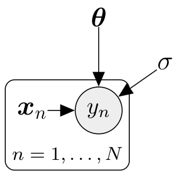
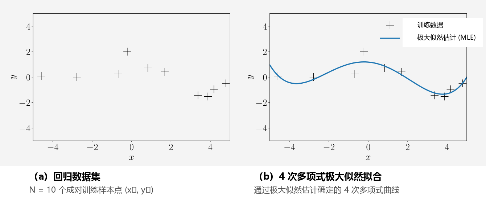
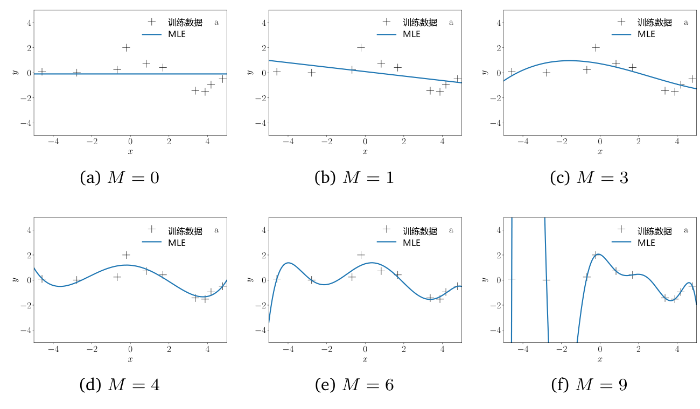
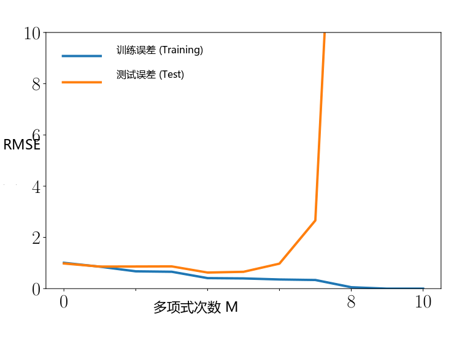
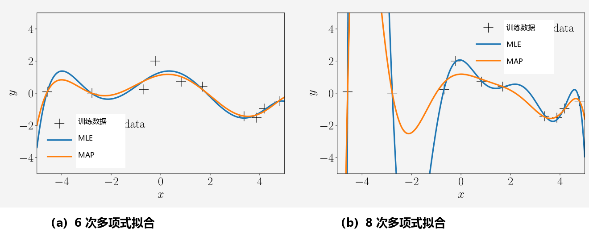

## 9.2 参数估计

考虑式 (9.4) 中的线性回归设定，并假设给定一个训练集 $\mathcal{D} := \{(\boldsymbol{x}_1, y_1), \ldots, (\boldsymbol{x}_N, y_N)\}$，其中包含 $N$ 个输入 $\boldsymbol{x}_n \in \mathbb{R}^D$ 及对应的观测/目标值 $y_n \in \mathbb{R}$（$n = 1, \ldots, N$）。对应的概率图模型如图 9.3 所示。

  
  
<b>图 9.3</b> 线性回归的概率图模型。观测随机变量带有阴影，确定性/已知值不带圆圈。

请注意，在给定各自的输入 $\boldsymbol{x}_i, \boldsymbol{x}_j$ 以及参数 $\boldsymbol{\theta}$ 的条件下，$y_i$ 与 $y_j$ 是条件独立的，因此似然函数可以按如下方式因式分解：

$$
p(\mathcal{Y} \mid \mathcal{X}, \boldsymbol{\theta}) = p(y_1, \ldots, y_N \mid \boldsymbol{x}_1, \ldots, \boldsymbol{x}_N, \boldsymbol{\theta})
\tag{9.5a}
$$

$$
= \prod_{n=1}^N p(y_n \mid \boldsymbol{x}_n, \boldsymbol{\theta}) = \prod_{n=1}^N \mathcal{N}\left(y_n \mid \boldsymbol{x}_n^\top \boldsymbol{\theta}, \sigma^2\right) ,
\tag{9.5b}
$$

其中我们将 $\mathcal{X} := \{\boldsymbol{x}_1, \ldots, \boldsymbol{x}_N\}$ 和 $\mathcal{Y} := \{y_1, \ldots, y_N\}$ 分别定义为训练输入集合与对应的目标值集合。由于噪声分布为高斯分布，似然函数及其各个因子 $p(y_n \mid \boldsymbol{x}_n, \boldsymbol{\theta})$ 均为高斯分布；参见式 (9.3)。

在下文中，我们将讨论如何为线性回归模型 (9.4) 寻找最优参数 $\boldsymbol{\theta}^* \in \mathbb{R}^D$。一旦找到参数 $\boldsymbol{\theta}^*$，我们便可以将该参数估计代入式 (9.4) 来预测函数值，从而对于任意测试输入 $\boldsymbol{x}_*$，对应目标值 $y_*$ 的分布为：

$$
p(y_* \mid \boldsymbol{x}_*, \boldsymbol{\theta}^*) = \mathcal{N}\left(y_* \mid \boldsymbol{x}_*^\top \boldsymbol{\theta}^*, \sigma^2\right) .
\tag{9.6}
$$

接下来，我们将首先考察通过最大化似然函数来进行参数估计的方法，我们在 8.3 节中已经对该主题做过一定程度的探讨。

---

### 9.2.1 极大似然估计

寻找所需参数 $\boldsymbol{\theta}_{\text{ML}}$ 的一种广泛采用的方法是 _极大似然估计（maximum likelihood estimation）_ ，即寻找使似然函数 (9.5b) 最大化的参数 $\boldsymbol{\theta}_{\text{ML}}$。直观上，最大化似然意味着在给定模型参数的条件下，最大化训练数据的预测概率分布。我们通过下式获得极大似然参数：

$$
\boldsymbol{\theta}_{\text{ML}} = \arg\max_{\boldsymbol{\theta}} p(\mathcal{Y} \mid \mathcal{X}, \boldsymbol{\theta}) .
\tag{9.7}
$$

 _备注_ 。似然 $p(y \mid \boldsymbol{x}, \boldsymbol{\theta})$ 并不是关于 $\boldsymbol{\theta}$ 的概率分布：它仅仅是参数 $\boldsymbol{\theta}$ 的函数，其对 $\boldsymbol{\theta}$ 的积分并不为 1（即它是未归一化的），甚至关于 $\boldsymbol{\theta}$ 可能根本不可积。然而，式 (9.7) 中的似然关于 $y$ 是一个归一化的概率分布。

为了寻找使似然最大化的参数 $\boldsymbol{\theta}_{\text{ML}}$，通常执行梯度上升法（或对负似然执行梯度下降法）。然而，在我们这里考虑的线性回归情形中，存在解析闭式解，这使得迭代梯度下降变得不再必要。在实践中，我们通常不对似然函数直接求最大值，而是对似然函数取对数变换，并最小化 _负对数似然（negative log-likelihood）_ 。

 _备注_ （对数变换） 。由于似然函数 (9.5b) 是 $N$ 个高斯分布的连乘积，对数变换之所以极其有用，是因为：(a) 它不会遭遇数值下溢问题；(b) 求导法则将变得更加简便。更具体地说，当数据点数量 $N$ 很大时，将 $N$ 个概率相乘会导致严重的数值下溢，因为计算机无法精确表示诸如 $10^{-256}$ 这样极小的正浮点数。此外，对数变换将连乘积转化为对数概率的连加和，使得对应的梯度等于各个单项梯度的简单求和，而无需反复应用乘积法则（式 (5.46)）来计算 $N$ 个项乘积的高阶梯度。

为了寻找线性回归问题的最优参数 $\boldsymbol{\theta}_{\text{ML}}$，我们最小化负对数似然：

$$
-\log p(\mathcal{Y} \mid \mathcal{X}, \boldsymbol{\theta}) = -\log \prod_{n=1}^N p(y_n \mid \boldsymbol{x}_n, \boldsymbol{\theta}) = -\sum_{n=1}^N \log p(y_n \mid \boldsymbol{x}_n, \boldsymbol{\theta}) ,
\tag{9.8}
$$

其中我们利用了基于训练集独立性假设而使似然函数 (9.5b) 能够在各数据点上因式分解的性质。在线性回归模型 (9.4) 中，似然为高斯分布（源于高斯加性噪声项），因此我们得到：

$$
\log p(y_n \mid \boldsymbol{x}_n, \boldsymbol{\theta}) = -\frac{1}{2\sigma^2}(y_n - \boldsymbol{x}_n^\top \boldsymbol{\theta})^2 + \text{const} ,
\tag{9.9}
$$

其中常数项包含了所有与 $\boldsymbol{\theta}$ 无关的项。将式 (9.9) 代入负对数似然 (9.8) 中，我们得到如下目标函数（忽略常数项）：

$$
L(\boldsymbol{\theta}) := \frac{1}{2\sigma^2}\sum_{n=1}^N (y_n - \boldsymbol{x}_n^\top \boldsymbol{\theta})^2
\tag{9.10a}
$$

$$
= \frac{1}{2\sigma^2}(\boldsymbol{y} - \boldsymbol{X}\boldsymbol{\theta})^\top(\boldsymbol{y} - \boldsymbol{X}\boldsymbol{\theta}) = \frac{1}{2\sigma^2}\|\boldsymbol{y} - \boldsymbol{X}\boldsymbol{\theta}\|^2 ,
\tag{9.10b}
$$

其中我们将 _设计矩阵（design matrix）_ 定义为收集所有训练输入的矩阵 $\boldsymbol{X} := [\boldsymbol{x}_1, \ldots, \boldsymbol{x}_N]^\top \in \mathbb{R}^{N \times D}$，将目标向量定义为收集所有训练标签的向量 $\boldsymbol{y} := [y_1, \ldots, y_N]^\top \in \mathbb{R}^N$。请注意，设计矩阵 $\boldsymbol{X}$ 的第 $n$ 行对应于第 $n$ 个训练输入 $\boldsymbol{x}_n$。在式 (9.10b) 中，我们利用了观测值 $y_n$ 与对应模型预测值 $\boldsymbol{x}_n^\top \boldsymbol{\theta}$ 之间的残差平方和等于向量 $\boldsymbol{y}$ 与 $\boldsymbol{X}\boldsymbol{\theta}$ 之间的欧几里得平方距离这一事实（回顾 3.1 节，当我们选择点积作为内积时，$\|\boldsymbol{x}\|^2 = \boldsymbol{x}^\top \boldsymbol{x}$）。负对数似然函数有时也称为 _误差函数（error function）_ 。

借助式 (9.10b)，我们获得了需要优化的负对数似然函数的具体形式。我们立即可以看出式 (9.10b) 关于 $\boldsymbol{\theta}$ 是二次的。这意味着我们可以找到唯一的全局最优解 $\boldsymbol{\theta}_{\text{ML}}$ 来最小化负对数似然 $L$。我们可以通过计算 $L$ 的梯度、令其为 $\boldsymbol{0}$ 并求解 $\boldsymbol{\theta}$ 来求得全局极小值。

运用第 5 章的结果，我们计算 $L$ 关于参数 $\boldsymbol{\theta}$ 的梯度为：

$$
\frac{\mathrm{d}L}{\mathrm{d}\boldsymbol{\theta}} = \frac{\mathrm{d}}{\mathrm{d}\boldsymbol{\theta}}\left[ \frac{1}{2\sigma^2}(\boldsymbol{y} - \boldsymbol{X}\boldsymbol{\theta})^\top(\boldsymbol{y} - \boldsymbol{X}\boldsymbol{\theta}) \right]
\tag{9.11a}
$$

$$
= \frac{1}{2\sigma^2}\frac{\mathrm{d}}{\mathrm{d}\boldsymbol{\theta}}\left[ \boldsymbol{y}^\top\boldsymbol{y} - 2\boldsymbol{y}^\top\boldsymbol{X}\boldsymbol{\theta} + \boldsymbol{\theta}^\top\boldsymbol{X}^\top\boldsymbol{X}\boldsymbol{\theta} \right]
\tag{9.11b}
$$

$$
= \frac{1}{\sigma^2}(-\boldsymbol{y}^\top\boldsymbol{X} + \boldsymbol{\theta}^\top\boldsymbol{X}^\top\boldsymbol{X}) \in \mathbb{R}^{1 \times D} .
\tag{9.11c}
$$

极大似然估计量 $\boldsymbol{\theta}_{\text{ML}}$ 满足一阶必要最优性条件 $\frac{\mathrm{d}L}{\mathrm{d}\boldsymbol{\theta}} = \boldsymbol{0}^\top$，从而我们得到：

$$
\frac{\mathrm{d}L}{\mathrm{d}\boldsymbol{\theta}} = \boldsymbol{0}^\top \overset{(9.11c)}{\iff} \boldsymbol{\theta}_{\text{ML}}^\top \boldsymbol{X}^\top \boldsymbol{X} = \boldsymbol{y}^\top \boldsymbol{X}
\tag{9.12a}
$$

$$
\iff \boldsymbol{\theta}_{\text{ML}}^\top = \boldsymbol{y}^\top \boldsymbol{X}(\boldsymbol{X}^\top \boldsymbol{X})^{-1}
\tag{9.12b}
$$

$$
\iff \boldsymbol{\theta}_{\text{ML}} = (\boldsymbol{X}^\top \boldsymbol{X})^{-1}\boldsymbol{X}^\top \boldsymbol{y} .
\tag{9.12c}
$$

忽略重复数据点的可能性，当 $N \geqslant D$（即数据点数量不少于参数个数）且 $\text{rk}(\boldsymbol{X}) = D$ 时，对称矩阵 $\boldsymbol{X}^\top \boldsymbol{X}$ 是正定的，因此我们可以在第一个方程两边右乘 $(\boldsymbol{X}^\top \boldsymbol{X})^{-1}$。

 _备注_ 。令梯度为 $\boldsymbol{0}^\top$ 在此处既是必要条件也是充分条件，因为其黑塞矩阵 $\nabla_{\boldsymbol{\theta}}^2 L(\boldsymbol{\theta}) = \frac{1}{\sigma^2}\boldsymbol{X}^\top \boldsymbol{X} \in \mathbb{R}^{D \times D}$ 是半正定的（当 $\text{rk}(\boldsymbol{X})=D$ 时严格正定），从而保证求得的驻点是全局极小值点。

 _备注_ 。式 (9.12c) 中的极大似然解要求我们求解形如 $\boldsymbol{A}\boldsymbol{\theta} = \boldsymbol{b}$ 的线性方程组（称为 _正规方程组（normal equations）_），其中 $\boldsymbol{A} = \boldsymbol{X}^\top \boldsymbol{X}$，$\boldsymbol{b} = \boldsymbol{X}^\top \boldsymbol{y}$。

> **例 9.2（拟合直线）**
>
> 让我们重新审视图 9.2，在该图中我们的目标是使用极大似然估计将一条直线 $f(x) = \theta x$（其中 $\theta$ 为未知斜率）拟合到数据集。该模型类（直线）中的函数示例显示在图 9.2(a) 中。对于图 9.2(b) 所示的数据集，我们利用式 (9.12c) 求解斜率参数 $\theta$ 的极大似然估计，最终得到图 9.2(c) 中的极大似然线性函数。

#### 带有特征映射的极大似然估计

到目前为止，我们考虑的是式 (9.4) 所描述的基础线性回归设定，它允许我们使用极大似然估计将直线拟合到数据中。然而，在拟合更具结构性的复杂数据时，单纯的直线表达能力明显不足。幸运的是，线性回归在线性框架内为我们提供了一种拟合非线性函数的强大途径：由于“线性回归”仅指“在参数上呈线性”，我们可以对输入 $\boldsymbol{x}$ 执行任意非线性变换 $\boldsymbol{\phi}(\boldsymbol{x})$，然后再对该变换的各分量进行线性组合。对应的线性回归模型为：

$$
p(y \mid \boldsymbol{x}, \boldsymbol{\theta}) = \mathcal{N}\left(y \mid \boldsymbol{\phi}^\top(\boldsymbol{x})\boldsymbol{\theta}, \sigma^2\right) \iff y = \boldsymbol{\phi}^\top(\boldsymbol{x})\boldsymbol{\theta} + \epsilon = \sum_{k=0}^{K-1}\theta_k \phi_k(\boldsymbol{x}) + \epsilon ,
\tag{9.13}
$$

其中 $\boldsymbol{\phi}: \mathbb{R}^D \to \mathbb{R}^K$ 是输入 $\boldsymbol{x}$ 的（非线性）特征映射变换，$\phi_k: \mathbb{R}^D \to \mathbb{R}$ 是 _特征向量（feature vector）_ $\boldsymbol{\phi}$ 的第 $k$ 个分量。需要重点强调的是，模型参数 $\boldsymbol{\theta}$ 在模型中仍然仅以线性形式出现。

> **例 9.3（多项式回归）**
>
> 考虑回归问题 $y = \boldsymbol{\phi}^\top(x)\boldsymbol{\theta} + \epsilon$，其中 $x \in \mathbb{R}$，$\boldsymbol{\theta} \in \mathbb{R}^K$。在此情境下常用的特征变换为单项式基函数：
>
> $$
> \boldsymbol{\phi}(x) = \begin{bmatrix} \phi_0(x) \\ \phi_1(x) \\ \vdots \\ \phi_{K-1}(x) \end{bmatrix} = \begin{bmatrix} 1 \\ x \\ x^2 \\ x^3 \\ \vdots \\ x^{K-1} \end{bmatrix} \in \mathbb{R}^K .
> \tag{9.14}
> $$
>
> 这意味着我们将原始一维输入空间“提升”（lift）到了由所有单项式 $x^k$（$k = 0, \ldots, K-1$）构成的 $K$ 维特征空间中。借助这些特征，我们可以在线性回归的统一框架下对阶数不超过 $K-1$ 的多项式进行建模：一个 $K-1$ 阶多项式表示为：
>
> $$
> f(x) = \sum_{k=0}^{K-1}\theta_k x^k = \boldsymbol{\phi}^\top(x)\boldsymbol{\theta} ,
> \tag{9.15}
> $$
>
> 其中 $\boldsymbol{\phi}$ 由式 (9.14) 定义，$\boldsymbol{\theta} = [\theta_0, \ldots, \theta_{K-1}]^\top \in \mathbb{R}^K$ 包含了全部（线性）参数 $\theta_k$。

现在让我们考察线性回归模型 (9.13) 中参数 $\boldsymbol{\theta}$ 的极大似然估计。我们考虑训练输入 $\boldsymbol{x}_n \in \mathbb{R}^D$ 及目标值 $y_n \in \mathbb{R}$（$n = 1, \ldots, N$），并将 _特征矩阵（feature matrix）_ （亦称设计矩阵）定义为：

$$
\boldsymbol{\Phi} := \begin{bmatrix} \boldsymbol{\phi}^\top(\boldsymbol{x}_1) \\ \vdots \\ \boldsymbol{\phi}^\top(\boldsymbol{x}_N) \end{bmatrix} = \begin{bmatrix} \phi_0(\boldsymbol{x}_1) & \cdots & \phi_{K-1}(\boldsymbol{x}_1) \\ \phi_0(\boldsymbol{x}_2) & \cdots & \phi_{K-1}(\boldsymbol{x}_2) \\ \vdots & & \vdots \\ \phi_0(\boldsymbol{x}_N) & \cdots & \phi_{K-1}(\boldsymbol{x}_N) \end{bmatrix} \in \mathbb{R}^{N \times K} ,
\tag{9.16}
$$

其中 $\Phi_{ij} = \phi_j(\boldsymbol{x}_i)$，$\phi_j: \mathbb{R}^D \to \mathbb{R}$。

> **例 9.4（二次多项式的特征矩阵）**
>
> 对于二次多项式及 $N$ 个一维训练数据点 $x_n \in \mathbb{R}$（$n = 1, \ldots, N$），其特征矩阵为：
>
> $$
> \boldsymbol{\Phi} = \begin{bmatrix} 1 & x_1 & x_1^2 \\ 1 & x_2 & x_2^2 \\ \vdots & \vdots & \vdots \\ 1 & x_N & x_N^2 \end{bmatrix} .
> \tag{9.17}
> $$

利用式 (9.16) 中定义的特征矩阵 $\boldsymbol{\Phi}$，线性回归模型 (9.13) 的负对数似然可紧凑写作：

$$
-\log p(\mathcal{Y} \mid \mathcal{X}, \boldsymbol{\theta}) = \frac{1}{2\sigma^2}(\boldsymbol{y} - \boldsymbol{\Phi}\boldsymbol{\theta})^\top(\boldsymbol{y} - \boldsymbol{\Phi}\boldsymbol{\theta}) + \text{const} .
\tag{9.18}
$$

将式 (9.18) 与未引入特征映射时的负对数似然 (9.10b) 进行对比，我们立刻发现只需将 $\boldsymbol{X}$ 替换为 $\boldsymbol{\Phi}$ 即可。由于 $\boldsymbol{X}$ 和 $\boldsymbol{\Phi}$ 均独立于我们要优化的参数 $\boldsymbol{\theta}$，我们立即得出带有非线性特征映射的线性回归问题的极大似然估计解：

$$
\boldsymbol{\theta}_{\text{ML}} = (\boldsymbol{\Phi}^\top \boldsymbol{\Phi})^{-1}\boldsymbol{\Phi}^\top \boldsymbol{y} .
\tag{9.19}
$$

 _备注_ 。在无特征映射的情形中，我们要求 $\boldsymbol{X}^\top \boldsymbol{X}$ 可逆，这在 $\boldsymbol{X}$ 的各列线性无关时成立。在式 (9.19) 中，我们相应地要求 $\boldsymbol{\Phi}^\top \boldsymbol{\Phi} \in \mathbb{R}^{K \times K}$ 可逆，这当且仅当 $\text{rk}(\boldsymbol{\Phi}) = K$ 时成立。

> **例 9.5（极大似然多项式拟合）**
>
> 考虑图 9.4(a) 所示的数据集。该数据集包含 $N = 10$ 对数据点 $(x_n, y_n)$，其中 $x_n \sim \mathcal{U}[-5, 5]$，$y_n = -\sin(x_n/5) + \cos(x_n) + \epsilon$，且 $\epsilon \sim \mathcal{N}(0, 0.2^2)$。
>
> 我们使用极大似然估计拟合一个 4 次多项式，即参数 $\boldsymbol{\theta}_{\text{ML}}$ 由式 (9.19) 计算给出。极大似然估计在任意测试输入位置 $x_*$ 处给出预测函数值 $\boldsymbol{\phi}^\top(x_*)\boldsymbol{\theta}_{\text{ML}}$。拟合结果如图 9.4(b) 所示。

  
  
<b>图 9.4</b> 多项式回归。(a) 由 (xₙ, yₙ) 数据对组成的数据集（n = 1, ..., 10）；(b) 极大似然估计确定的 4 次多项式拟合。

#### 估计噪声方差

迄今为止，我们一直假定噪声方差 $\sigma^2$ 是已知的先验常数。然而，我们同样可以利用极大似然原理来获取噪声方差的极大似然估计量 $\sigma_{\text{ML}}^2$。为此，我们遵循标准流程：写出关于参数和方差的对数似然，计算其对 $\sigma^2 > 0$ 的偏导数，令偏导数为 0 并求解。对数似然由下式给出：

$$
\log p(\mathcal{Y} \mid \mathcal{X}, \boldsymbol{\theta}, \sigma^2) = \sum_{n=1}^N \log \mathcal{N}\left(y_n \mid \boldsymbol{\phi}^\top(\boldsymbol{x}_n)\boldsymbol{\theta}, \sigma^2\right)
\tag{9.20a}
$$

$$
= \sum_{n=1}^N \left[ -\frac{1}{2}\log(2\pi) - \frac{1}{2}\log \sigma^2 - \frac{1}{2\sigma^2}(y_n - \boldsymbol{\phi}^\top(\boldsymbol{x}_n)\boldsymbol{\theta})^2 \right]
\tag{9.20b}
$$

$$
= -\frac{N}{2}\log \sigma^2 - \frac{1}{2\sigma^2}\underbrace{\sum_{n=1}^N (y_n - \boldsymbol{\phi}^\top(\boldsymbol{x}_n)\boldsymbol{\theta})^2}_{=: s} + \text{const} .
\tag{9.20c}
$$

对数似然关于 $\sigma^2$ 的偏导数为：

$$
\frac{\partial \log p(\mathcal{Y} \mid \mathcal{X}, \boldsymbol{\theta}, \sigma^2)}{\partial \sigma^2} = -\frac{N}{2\sigma^2} + \frac{1}{2\sigma^4}s = 0
\tag{9.21a}
$$

$$
\iff \frac{N}{2\sigma^2} = \frac{s}{2\sigma^4} ,
\tag{9.21b}
$$

由此我们解出噪声方差的极大似然估计：

$$
\sigma_{\text{ML}}^2 = \frac{s}{N} = \frac{1}{N}\sum_{n=1}^N (y_n - \boldsymbol{\phi}^\top(\boldsymbol{x}_n)\boldsymbol{\theta})^2 .
\tag{9.22}
$$

因此，噪声方差的极大似然估计正是无噪声模型预测值 $\boldsymbol{\phi}^\top(\boldsymbol{x}_n)\boldsymbol{\theta}$ 与相应带噪声观测值 $y_n$ 之间残差平方的 _经验均值（empirical mean）_ 。

---

### 9.2.2 线性回归中的过拟合

我们刚才讨论了如何使用极大似然估计将线性模型（例如多项式）拟合到数据中。我们可以通过计算产生的误差/损失来评估模型的质量。一种方法是计算式 (9.10b) 的负对数似然（我们正是通过最小化该目标来确定极大似然估计量的）。或者，鉴于噪声参数 $\sigma^2$ 不是模型自由参数，我们可以忽略缩放系数 $1/\sigma^2$，从而得到平方误差损失函数 $\|\boldsymbol{y} - \boldsymbol{\Phi}\boldsymbol{\theta}\|^2$。与单纯使用平方损失相比，人们在实践中更常用 _均方根误差（root mean square error, RMSE）_ ：

$$
\text{RMSE} := \sqrt{\frac{1}{N}\|\boldsymbol{y} - \boldsymbol{\Phi}\boldsymbol{\theta}\|^2} = \sqrt{\frac{1}{N}\sum_{n=1}^N (y_n - \boldsymbol{\phi}^\top(\boldsymbol{x}_n)\boldsymbol{\theta})^2} ,
\tag{9.23}
$$

RMSE 的优势在于：(a) 允许我们在样本规模不同、包含不同数据量的数据集之间公平比较误差；(b) 具有与观测函数值 $y_n$ 完全相同的尺度和物理量纲单位。例如，若我们拟合一个将邮政编码（输入 $\boldsymbol{x}$ 为纬度与经度）映射到房屋售价（目标 $y$ 的单位为欧元）的模型，则 RMSE 的测量单位同样是欧元，而平方误差的单位则是欧元$^2$。如果我们在原始负对数似然 (9.10b) 中保留系数 $\sigma^2$，得到的目标函数则是无量纲（unitless）的纯数指标。

在模型选择中（参见 8.6 节），我们可以使用 RMSE（或负对数似然）通过寻找使目标最小化的多项式阶数 $M$ 来确定最佳的多项式模型。由于多项式阶数是非负整数，我们可以执行暴力网格搜索并枚举所有（合理的）$M$ 取值。对于规模为 $N$ 的训练集，测试 $0 \leqslant M \leqslant N-1$ 就足够了。当 $M < N$ 时，极大似然估计量是唯一的；当 $M \geqslant N$ 时，参数数量超过了数据点数量，此时我们需要求解一个欠定线性方程组（式 (9.19) 中的 $\boldsymbol{\Phi}^\top \boldsymbol{\Phi}$ 将不再可逆），从而存在无穷多个可能的极大似然估计量。

  
  
<b>图 9.5</b> 不同多项式阶数 M 下的极大似然拟合结果对比。

图 9.5 展示了针对图 9.4(a) 中 $N = 10$ 个观测数据点，通过极大似然估计确定的若干不同阶数的多项式拟合曲线。我们注意到：
- 低阶多项式（例如常数 $M = 0$ 或线性 $M = 1$）拟合效果很差，无法捕捉真实底层函数的特征；
- 对于中等阶数 $M = 3, 4, 5$，拟合曲线十分合情合理，平滑地穿过了数据点分布的主要趋势；
- 当多项式阶数进一步增加时，训练数据上的拟合看起来越来越完美。在 $M = N-1 = 9$ 的极端情况下，函数曲线完美穿过了每一个训练样本点！然而，这些高阶多项式在样本点之间产生了剧烈的振荡，完全无法代表生成数据的真实底层函数，即发生了严重的 _过拟合（overfitting）_ 。

请牢记，机器学习的终极目标是在未见过的测试新数据上做出准确预测，从而实现良好的泛化能力。为了定量评估泛化性能对多项式阶数 $M$ 的依赖性，我们引入一个由 200 个数据点组成的独立测试集，该测试集使用与生成训练集完全相同的底层函数与噪声机制生成。测试输入选取为区间 $[-5, 5]$ 内均匀分布的 200 个网格点。对于每一个 $M$，我们分别评估训练数据和测试数据上的 RMSE (9.23)。

  
  
<b>图 9.6</b> 训练误差与测试误差随多项式阶数 M 的变化曲线。

考察作为泛化性能定性指标的测试误差，我们发现：
- 如图 9.6 所示，最初随着多项式阶数增加，测试误差（橙色曲线）迅速下降；
- 在 4 阶多项式附近，测试误差达到较低值并在 5 阶之前保持相对平稳；
- 然而，从 6 阶开始，测试误差急剧飙升，更高阶的多项式表现出极差的泛化能力。
与此同时，训练误差（图 9.6 中的蓝色曲线）随着多项式阶数的增加而单调非递增。在本示例中，最优的泛化效果（即测试误差最低点）在阶数 $M = 4$ 处取得。

---

### 9.2.3 最大后验估计

我们刚刚看到，极大似然估计极易遭受过拟合问题。当发生过拟合时，我们常常会观察到模型参数的数值绝对值变得异常庞大（Bishop, 2006）。

为了抑制参数绝对值过度膨胀的现象，我们可以在参数上引入一个 _先验分布（prior distribution）_ $p(\boldsymbol{\theta})$。先验分布显式地编码了在看到任何数据之前，哪些参数取值在常理上是可信且合理的。例如，对单个参数 $\theta$ 赋予高斯先验 $p(\theta) = \mathcal{N}(0, 1)$ 表明我们预期该参数取值以 95% 的概率落在均值两侧两个标准差区间 $[-2, 2]$ 内。

一旦获取了观测数据集 $\mathcal{X}, \mathcal{Y}$，我们不再单纯最大化似然，而是寻找使 _后验分布（posterior distribution）_ $p(\boldsymbol{\theta} \mid \mathcal{X}, \mathcal{Y})$ 最大化的参数。这一过程被称为 _最大后验估计（maximum a posteriori estimation, MAP）_ 。

给定训练数据 $\mathcal{X}, \mathcal{Y}$，参数 $\boldsymbol{\theta}$ 的后验分布通过贝叶斯定理（6.3 节）求得：

$$
p(\boldsymbol{\theta} \mid \mathcal{X}, \mathcal{Y}) = \frac{p(\mathcal{Y} \mid \mathcal{X}, \boldsymbol{\theta})p(\boldsymbol{\theta})}{p(\mathcal{Y} \mid \mathcal{X})} .
\tag{9.24}
$$

由于后验分布显式依赖于参数先验 $p(\boldsymbol{\theta})$，先验自然会对最大化后验所得的最优参数矢量产生决定性的调节作用。使后验分布 (9.24) 最大化的参数矢量 $\boldsymbol{\theta}_{\text{MAP}}$ 即为 MAP 估计量。

为了求得 MAP 估计量，我们采取与极大似然估计极为相似的步骤。首先对后验概率取对数，得到对数后验：

$$
\log p(\boldsymbol{\theta} \mid \mathcal{X}, \mathcal{Y}) = \log p(\mathcal{Y} \mid \mathcal{X}, \boldsymbol{\theta}) + \log p(\boldsymbol{\theta}) + \text{const} ,
\tag{9.25}
$$

其中常数项包含了所有与 $\boldsymbol{\theta}$ 无关的项。我们看到，式 (9.25) 中的对数后验恰好是对数似然与对数先验的代数和，因此 MAP 估计本质上是先验（观测数据前我们对合理解的主观设定）与依赖于具体数据的似然之间的一种“折衷妥协”。

为了求得 MAP 估计量 $\boldsymbol{\theta}_{\text{MAP}}$，我们最小化关于 $\boldsymbol{\theta}$ 的负对数后验分布，即求解：

$$
\boldsymbol{\theta}_{\text{MAP}} \in \arg\min_{\boldsymbol{\theta}} \left\{ -\log p(\mathcal{Y} \mid \mathcal{X}, \boldsymbol{\theta}) - \log p(\boldsymbol{\theta}) \right\} .
\tag{9.26}
$$

负对数后验关于 $\boldsymbol{\theta}$ 的梯度为：

$$
-\frac{\mathrm{d}\log p(\boldsymbol{\theta} \mid \mathcal{X}, \mathcal{Y})}{\mathrm{d}\boldsymbol{\theta}} = -\frac{\mathrm{d}\log p(\mathcal{Y} \mid \mathcal{X}, \boldsymbol{\theta})}{\mathrm{d}\boldsymbol{\theta}} - \frac{\mathrm{d}\log p(\boldsymbol{\theta})}{\mathrm{d}\boldsymbol{\theta}} ,
\tag{9.27}
$$

其中等号右侧第一项正是我们在式 (9.11c) 中求得的负对数似然的梯度。

若在参数 $\boldsymbol{\theta}$ 上赋予（共轭）高斯先验 $p(\boldsymbol{\theta}) = \mathcal{N}(\boldsymbol{0}, b^2\boldsymbol{I})$，对于线性回归设定 (9.13)，我们得到具体的负对数后验表达式：

$$
-\log p(\boldsymbol{\theta} \mid \mathcal{X}, \mathcal{Y}) = \frac{1}{2\sigma^2}(\boldsymbol{y} - \boldsymbol{\Phi}\boldsymbol{\theta})^\top(\boldsymbol{y} - \boldsymbol{\Phi}\boldsymbol{\theta}) + \frac{1}{2b^2}\boldsymbol{\theta}^\top \boldsymbol{\theta} + \text{const} .
\tag{9.28}
$$

在此，第一项对应于对数似然的贡献，而第二项则来源于对数先验。此时，对数后验关于参数 $\boldsymbol{\theta}$ 的梯度为：

$$
-\frac{\mathrm{d}\log p(\boldsymbol{\theta} \mid \mathcal{X}, \mathcal{Y})}{\mathrm{d}\boldsymbol{\theta}} = \frac{1}{\sigma^2}(\boldsymbol{\theta}^\top \boldsymbol{\Phi}^\top \boldsymbol{\Phi} - \boldsymbol{y}^\top \boldsymbol{\Phi}) + \frac{1}{b^2}\boldsymbol{\theta}^\top .
\tag{9.29}
$$

令该梯度为 $\boldsymbol{0}^\top$ 并求解 $\boldsymbol{\theta}_{\text{MAP}}$：

$$
\frac{1}{\sigma^2}(\boldsymbol{\theta}^\top \boldsymbol{\Phi}^\top \boldsymbol{\Phi} - \boldsymbol{y}^\top \boldsymbol{\Phi}) + \frac{1}{b^2}\boldsymbol{\theta}^\top = \boldsymbol{0}^\top
\tag{9.30a}
$$

$$
\iff \boldsymbol{\theta}^\top \left( \frac{1}{\sigma^2}\boldsymbol{\Phi}^\top \boldsymbol{\Phi} + \frac{1}{b^2}\boldsymbol{I} \right) - \frac{1}{\sigma^2}\boldsymbol{y}^\top \boldsymbol{\Phi} = \boldsymbol{0}^\top
\tag{9.30b}
$$

$$
\iff \boldsymbol{\theta}^\top \left( \boldsymbol{\Phi}^\top \boldsymbol{\Phi} + \frac{\sigma^2}{b^2}\boldsymbol{I} \right) = \boldsymbol{y}^\top \boldsymbol{\Phi}
\tag{9.30c}
$$

$$
\iff \boldsymbol{\theta}^\top = \boldsymbol{y}^\top \boldsymbol{\Phi}\left( \boldsymbol{\Phi}^\top \boldsymbol{\Phi} + \frac{\sigma^2}{b^2}\boldsymbol{I} \right)^{-1} .
\tag{9.30d}
$$

对最后等式两边进行转置，最终得到 MAP 估计量的解析闭式解：

$$
\boldsymbol{\theta}_{\text{MAP}} = \left( \boldsymbol{\Phi}^\top \boldsymbol{\Phi} + \frac{\sigma^2}{b^2}\boldsymbol{I} \right)^{-1}\boldsymbol{\Phi}^\top \boldsymbol{y} .
\tag{9.31}
$$

将式 (9.31) 中的 MAP 估计与式 (9.19) 中的极大似然估计进行对比，我们清晰地看到两种解之间的唯一差异是在求逆矩阵中增加了额外的项 $\frac{\sigma^2}{b^2}\boldsymbol{I}$。因为对称矩阵 $\boldsymbol{\Phi}^\top \boldsymbol{\Phi}$ 是半正定的，而附加项 $\frac{\sigma^2}{b^2}\boldsymbol{I}$ 是严格正定的（当方差 $b^2 > 0$ 时），所以它们的和始终严格正定，从而保证了逆矩阵必然存在，使得 MAP 估计成为线性方程组唯一的稳定解。此外，这一项直接体现了正则化机制的作用。

> **例 9.6（多项式回归的 MAP 估计）**
>
> 在 9.2.1 节的多项式回归示例中，我们在参数 $\boldsymbol{\theta}$ 上赋予高斯先验 $p(\boldsymbol{\theta}) = \mathcal{N}(\boldsymbol{0}, \boldsymbol{I})$，并根据式 (9.31) 求解 MAP 估计。在图 9.7 中，我们展示了 6 阶（左）和 8 阶（右）多项式的极大似然估计与 MAP 估计对比。对于较低阶的多项式，先验（正则项）的影响微乎其微；但对于高阶多项式，先验能够强有力地约束振荡，使拟合函数保持平滑。虽然 MAP 估计能够拓宽抵御过拟合的边界，但它并非彻底解决该问题的万灵药，我们依然需要更具原则性的系统方法来应对过拟合。

  
  
<b>图 9.7</b> 多项式回归：极大似然估计与 MAP 估计对比。(a) 6 阶多项式；(b) 8 阶多项式。

---

### 9.2.4 作为正则化的 MAP 估计

除了在参数 $\boldsymbol{\theta}$ 上引入先验分布之外，另一种缓解过拟合效应的途径是通过 _正则化（regularization）_ 手段直接惩罚过大的参数幅度。在 _ 正则化最小二乘（regularized least squares）_ 中，我们考虑如下损失函数并对 $\boldsymbol{\theta}$ 进行最小化（参见 8.2.3 节）：

$$
\|\boldsymbol{y} - \boldsymbol{\Phi}\boldsymbol{\theta}\|^2 + \lambda \|\boldsymbol{\theta}\|_2^2 ,
\tag{9.32}
$$

其中第一项是数据拟合项（亦称拟合残差项），它正比于负对数似然（参见式 (9.10b)）；第二项称为 _正则化项（regularizer）_ ，正则化超参数 $\lambda \geqslant 0$ 控制着正则化的“惩罚力度”。

 _备注_ 。在式 (9.32) 中，我们不仅可以使用欧几里得范数 $\|\cdot\|_2$，还可以选用任意的 $p$-范数 $\|\cdot\|_p$。在实践中，较小的 $p$ 值倾向于产生稀疏解。这里的“稀疏”指的是许多参数分量精确为零（$\theta_d = 0$），这对于特征与变量选择非常有用。当 $p = 1$ 时，该正则化器被称为 LASSO（最小绝对收缩与选择算子），由 Tibshirani (1996) 提出。

式 (9.32) 中的正则化项 $\lambda \|\boldsymbol{\theta}\|_2^2$ 可以直接阐释为 MAP 估计中使用的负对数高斯先验（参见式 (9.26)）。具体而言，对于高斯先验 $p(\boldsymbol{\theta}) = \mathcal{N}(\boldsymbol{0}, b^2\boldsymbol{I})$，我们有：

$$
-\log p(\boldsymbol{\theta}) = \frac{1}{2b^2}\|\boldsymbol{\theta}\|_2^2 + \text{const} ,
\tag{9.33}
$$

因此当令 $\lambda = \frac{\sigma^2}{b^2}$ 时，正则化最小二乘的目标函数与 MAP 估计中的负对数后验函数在常数因子意义下完全等价。

鉴于式 (9.32) 中的正则化最小二乘损失函数由负对数似然与负对数先验两部分紧密构成，最小化该损失所得的解自然与 MAP 估计 (9.31) 具有完全相同的数学形式。更明确地说，最小化正则化最小二乘损失函数得到：

$$
\boldsymbol{\theta}_{\text{RLS}} = (\boldsymbol{\Phi}^\top \boldsymbol{\Phi} + \lambda \boldsymbol{I})^{-1}\boldsymbol{\Phi}^\top \boldsymbol{y} ,
\tag{9.34}
$$

当设置 $\lambda = \frac{\sigma^2}{b^2}$ 时，该式与式 (9.31) 中的 MAP 估计完全重合，其中 $\sigma^2$ 为观测噪声方差，$b^2$ 为各向同性高斯先验 $p(\boldsymbol{\theta}) = \mathcal{N}(\boldsymbol{0}, b^2\boldsymbol{I})$ 的先验方差。

迄今为止，我们探讨了基于极大似然估计和 MAP 估计的参数求解，在这两种方法中，我们均通过优化某个目标函数（似然或后验）来求取参数的单一数值点估计 $\boldsymbol{\theta}^*$。我们发现，极大似然估计和 MAP 估计在小样本或高维模型下均可能诱发过拟合。在下一节中，我们将讨论 _贝叶斯线性回归（Bayesian linear regression）_ ，在该框架下，我们运用贝叶斯推断（8.4 节）直接推导未知参数的完整后验概率分布，并随后据此进行预测。具体而言，在进行预测时，我们将对所有合理的可能参数配置进行概率加权平均，而非将目光局限在单一的点估计上。
