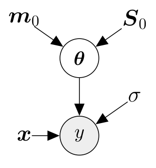
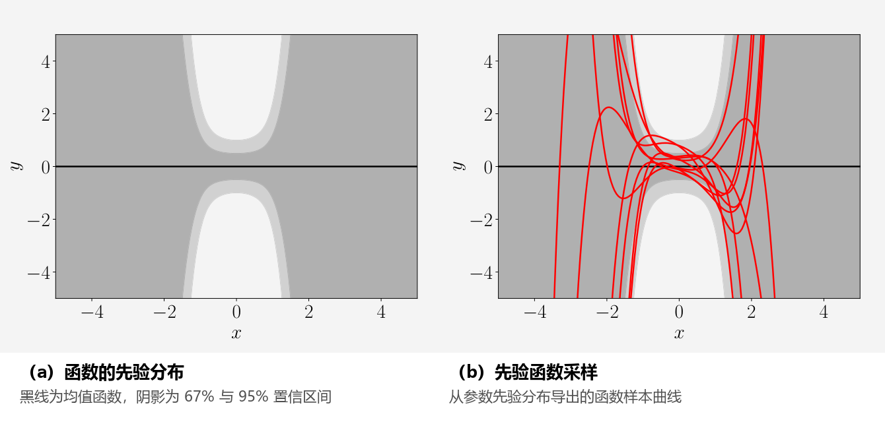
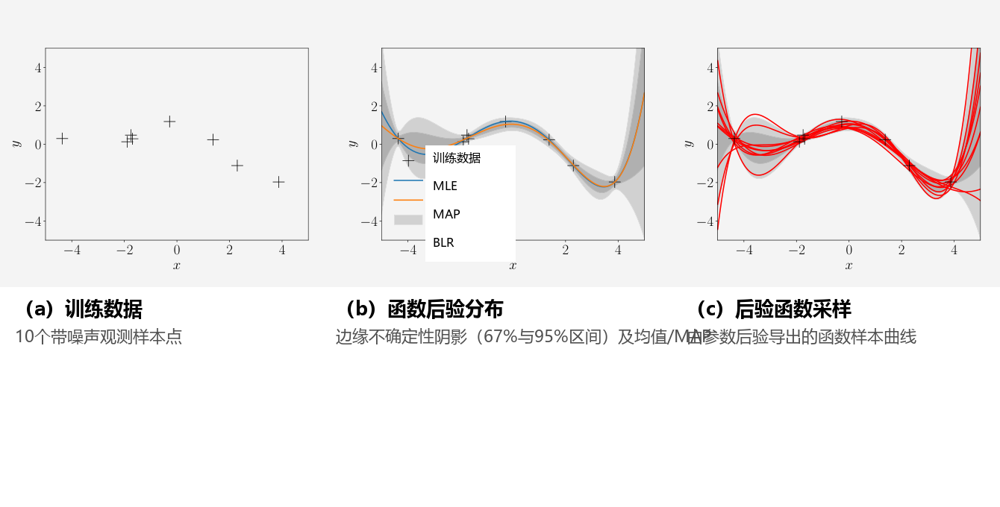
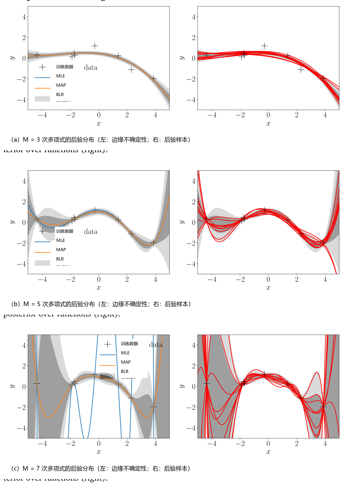

## 9.3 贝叶斯线性回归

在前面两节中，我们考察了通过极大似然估计或 MAP 估计来估计模型参数 $\boldsymbol{\theta}$ 的线性回归方法。我们发现，极大似然估计极易导致严重的过拟合，特别是在小数据量的情形下；MAP 估计通过在参数上引入先验分布起到正则化作用，从而缓解了这一问题。

_贝叶斯线性回归（Bayesian linear regression）_ 将参数先验的思想更进一步：它甚至不再尝试计算参数的单一数值点估计，而是在进行预测时将参数的完整后验概率分布全面考虑在内。这意味着我们不再拟合任何单一参数值，而是（依据后验分布）对所有合理解的预测结果进行加权平均。

---

### 9.3.1 模型

在贝叶斯线性回归中，我们考虑如下模型设定：

$$
\text{先验：} \quad p(\boldsymbol{\theta}) = \mathcal{N}\left(\boldsymbol{\theta} \mid \boldsymbol{m}_0, \boldsymbol{S}_0\right) ,
\tag{9.35}
$$

$$
\text{似然：} \quad p(y \mid \boldsymbol{x}, \boldsymbol{\theta}) = \mathcal{N}\left(y \mid \boldsymbol{\phi}^\top(\boldsymbol{x})\boldsymbol{\theta}, \sigma^2\right) ,
$$

在此，我们在参数 $\boldsymbol{\theta}$ 上显式地赋予高斯先验 $p(\boldsymbol{\theta}) = \mathcal{N}(\boldsymbol{m}_0, \boldsymbol{S}_0)$，从而将参数矢量转变成了一个随机变量。这使我们能够画出图 9.8 所示的对应概率图模型，其中将 $\boldsymbol{\theta}$ 的高斯先验参数显式表示了出来。完整的概率模型，即观测随机变量 $y$ 与未观测随机变量 $\boldsymbol{\theta}$ 的联合分布为：

$$
p(y, \boldsymbol{\theta} \mid \boldsymbol{x}) = p(y \mid \boldsymbol{x}, \boldsymbol{\theta})p(\boldsymbol{\theta}) .
\tag{9.36}
$$

  
  
<b>图 9.8</b> 贝叶斯线性回归的图模型。参数 θ 被赋予高斯先验，从而转变为模型的随机变量。

---

### 9.3.2 先验预测

在实际应用中，我们通常对参数值 $\boldsymbol{\theta}$ 本身并不最感兴趣。相反，我们的核心关注点往往是利用这些参数值做出的预测。在贝叶斯框架下，我们在进行预测时会综合考虑参数的概率分布，并对所有合理的参数取值进行期望平均。更明确地说，为了在任意新测试输入 $\boldsymbol{x}_*$ 处进行预测，我们将未知参数 $\boldsymbol{\theta}$ 边缘化积分离出，得到 _先验预测分布（prior predictive distribution）_ ：

$$
p(y_* \mid \boldsymbol{x}_*) = \int p(y_* \mid \boldsymbol{x}_*, \boldsymbol{\theta})p(\boldsymbol{\theta}) \mathrm{d}\boldsymbol{\theta} = \mathbb{E}_{\boldsymbol{\theta}}\left[ p(y_* \mid \boldsymbol{x}_*, \boldsymbol{\theta}) \right] ,
\tag{9.37}
$$

我们可以将其理解为依据先验分布 $p(\boldsymbol{\theta})$ 对所有合理参数 $\boldsymbol{\theta}$ 下条件预测分布 $p(y_* \mid \boldsymbol{x}_*, \boldsymbol{\theta})$ 的加权平均预测。请注意，仅使用先验分布进行预测只需要我们指定测试输入 $\boldsymbol{x}_*$，而完全不需要任何训练数据。

在我们的模型 (9.35) 中，由于在 $\boldsymbol{\theta}$ 上选择了共轭（高斯）先验，先验预测分布本身同样是一个高斯分布（并且可以解析闭式计算）：在先验分布 $p(\boldsymbol{\theta}) = \mathcal{N}(\boldsymbol{m}_0, \boldsymbol{S}_0)$ 下，我们计算得到先验预测分布为：

$$
p(y_* \mid \boldsymbol{x}_*) = \mathcal{N}\left(y_* \mid \boldsymbol{\phi}^\top(\boldsymbol{x}_*)\boldsymbol{m}_0, \boldsymbol{\phi}^\top(\boldsymbol{x}_*)\boldsymbol{S}_0\boldsymbol{\phi}(\boldsymbol{x}_*) + \sigma^2\right) ,
\tag{9.38}
$$

这里我们利用了以下性质：
1. 由于先验与高斯似然的共轭性（见 6.6 节）以及高斯分布的边缘化性质（见 6.5 节），预测分布必为高斯分布；
2. 独立的高斯加性噪声使得预测方差分解为：
   
$$
\mathbb{V}[y_*] = \mathbb{V}_{\boldsymbol{\theta}}\left[\boldsymbol{\phi}^\top(\boldsymbol{x}_*)\boldsymbol{\theta}\right] + \mathbb{V}_{\epsilon}[\epsilon] ;
\tag{9.39}
$$

3. $y_*$ 是参数 $\boldsymbol{\theta}$ 的仿射变换，因此我们可以直接运用式 (6.50) 与 (6.51) 解析计算预测均值与方差。

在式 (9.38) 中，预测方差中的项 $\boldsymbol{\phi}^\top(\boldsymbol{x}_*)\boldsymbol{S}_0\boldsymbol{\phi}(\boldsymbol{x}_*)$ 显式解释了与模型参数 $\boldsymbol{\theta}$ 关联的不确定性，而 $\sigma^2$ 则是源于测量噪声的不确定性贡献。

如果我们感兴趣的是预测无噪声的真实函数值 $f(\boldsymbol{x}_*) = \boldsymbol{\phi}^\top(\boldsymbol{x}_*)\boldsymbol{\theta}$，而非带有噪声污染的目标观测值 $y_*$，则有：

$$
p(f(\boldsymbol{x}_*)) = \mathcal{N}\left(f(\boldsymbol{x}_*) \mid \boldsymbol{\phi}^\top(\boldsymbol{x}_*)\boldsymbol{m}_0, \boldsymbol{\phi}^\top(\boldsymbol{x}_*)\boldsymbol{S}_0\boldsymbol{\phi}(\boldsymbol{x}_*)\right) ,
\tag{9.40}
$$

该式与式 (9.38) 的唯一区别是在预测方差中省略了观测噪声方差 $\sigma^2$。

_备注_ （函数上的分布） 。由于我们可以用一组样本点 $\boldsymbol{\theta}_i$ 来近似表示分布 $p(\boldsymbol{\theta})$，且每一个参数样本 $\boldsymbol{\theta}_i$ 都会对应确定一条具体的函数曲线 $f_i(\cdot) = \boldsymbol{\theta}_i^\top \boldsymbol{\phi}(\cdot)$，因此参数分布 $p(\boldsymbol{\theta})$ 自然诱导出了定义在函数空间上的分布 $p(f(\cdot))$。在此我们使用记号 $(\cdot)$ 显式表示这种函数映射关系。

> **例 9.7（函数上的先验分布）**
>
> 考虑阶数为 5 的多项式贝叶斯线性回归问题。我们选择参数先验分布为 $p(\boldsymbol{\theta}) = \mathcal{N}(\boldsymbol{0}, \frac{1}{4}\boldsymbol{I})$。图 9.9 可视化了由该参数先验诱导出的函数先验分布（深灰色阴影表示 67% 置信区间；浅灰色阴影表示 95% 置信区间），以及从该先验中抽取的若干函数样本。
>
> 函数样本的生成过程为：首先从参数先验中抽取一个参数矢量 $\boldsymbol{\theta}_i \sim p(\boldsymbol{\theta})$，然后计算 $f_i(\cdot) = \boldsymbol{\theta}_i^\top \boldsymbol{\phi}(\cdot)$。我们选用了区间 $[-5, 5]$ 内的 200 个输入位置 $x_*$ 并施加特征映射 $\boldsymbol{\phi}(\cdot)$。图 9.9 中的不确定性（由阴影区域表示）完全源于参数的不确定性，因为此处我们考察的是无噪声的预测分布 (9.40)。

  
  
<b>图 9.9</b> 函数上的先验分布。(a) 由均值函数（黑线）与边缘不确定性（阴影，分别代表 67% 和 95% 置信区间）表示的函数分布；(b) 从函数先验分布中采样的函数样本。

迄今为止，我们考察了仅利用参数先验 $p(\boldsymbol{\theta})$ 计算预测分布。然而，当我们拥有了基于训练数据 $\mathcal{X}, \mathcal{Y}$ 的参数后验分布后，预测和推断的原则与式 (9.37) 完全一致——我们只需将先验分布 $p(\boldsymbol{\theta})$ 替换为后验分布 $p(\boldsymbol{\theta} \mid \mathcal{X}, \mathcal{Y})$ 即可。在下文中，我们将先详细推导参数后验分布，然后再利用它进行预测。

---

### 9.3.3 后验分布

给定由输入 $\boldsymbol{x}_n \in \mathbb{R}^D$ 及对应观测值 $y_n \in \mathbb{R}$（$n = 1, \ldots, N$）组成的训练集，我们利用贝叶斯定理计算参数的后验分布：

$$
p(\boldsymbol{\theta} \mid \mathcal{X}, \mathcal{Y}) = \frac{p(\mathcal{Y} \mid \mathcal{X}, \boldsymbol{\theta})p(\boldsymbol{\theta})}{p(\mathcal{Y} \mid \mathcal{X})} ,
\tag{9.41}
$$

其中 $\mathcal{X}$ 为训练输入集合，$\mathcal{Y}$ 为对应的训练目标集合。此外，$p(\mathcal{Y} \mid \mathcal{X}, \boldsymbol{\theta})$ 为似然函数，$p(\boldsymbol{\theta})$ 为参数先验，而

$$
p(\mathcal{Y} \mid \mathcal{X}) = \int p(\mathcal{Y} \mid \mathcal{X}, \boldsymbol{\theta})p(\boldsymbol{\theta}) \mathrm{d}\boldsymbol{\theta} = \mathbb{E}_{\boldsymbol{\theta}}\left[ p(\mathcal{Y} \mid \mathcal{X}, \boldsymbol{\theta}) \right]
\tag{9.42}
$$

为 _边缘似然（marginal likelihood）_ （亦称 _ 模型证据（evidence）_）。它与模型参数 $\boldsymbol{\theta}$ 无关，起到了归一化常数的作用，确保后验分布全域积分为 1。我们可以将边缘似然理解为似然在参数先验分布 $p(\boldsymbol{\theta})$ 下关于所有可能参数配置的期望平均。

**定理 9.1（参数后验分布）**。在模型 (9.35) 中，参数后验分布 (9.41) 可以闭式计算为高斯分布：

$$
p(\boldsymbol{\theta} \mid \mathcal{X}, \mathcal{Y}) = \mathcal{N}\left(\boldsymbol{\theta} \mid \boldsymbol{m}_N, \boldsymbol{S}_N\right) ,
\tag{9.43a}
$$

$$
\boldsymbol{S}_N = \left(\boldsymbol{S}_0^{-1} + \sigma^{-2}\boldsymbol{\Phi}^\top \boldsymbol{\Phi}\right)^{-1} ,
\tag{9.43b}
$$

$$
\boldsymbol{m}_N = \boldsymbol{S}_N\left(\boldsymbol{S}_0^{-1}\boldsymbol{m}_0 + \sigma^{-2}\boldsymbol{\Phi}^\top \boldsymbol{y}\right) ,
\tag{9.43c}
$$

其中下标 $N$ 表示训练集的样本容量。

*证明*。
根据贝叶斯定理，后验分布 $p(\boldsymbol{\theta} \mid \mathcal{X}, \mathcal{Y})$ 正比于似然函数与先验分布的乘积：

$$
\text{后验：} \quad p(\boldsymbol{\theta} \mid \mathcal{X}, \mathcal{Y}) = \frac{p(\mathcal{Y} \mid \mathcal{X}, \boldsymbol{\theta})p(\boldsymbol{\theta})}{p(\mathcal{Y} \mid \mathcal{X})}
\tag{9.44a}
$$

$$
\text{似然：} \quad p(\mathcal{Y} \mid \mathcal{X}, \boldsymbol{\theta}) = \mathcal{N}\left(\boldsymbol{y} \mid \boldsymbol{\Phi}\boldsymbol{\theta}, \sigma^2\boldsymbol{I}\right)
\tag{9.44b}
$$

$$
\text{先验：} \quad p(\boldsymbol{\theta}) = \mathcal{N}\left(\boldsymbol{\theta} \mid \boldsymbol{m}_0, \boldsymbol{S}_0\right) .
\tag{9.44c}
$$

与其直接计算先验与似然的乘积，我们更方便将问题转换到对数空间中，并通过配方法（completing the squares）求解后验的均值与协方差。

对数先验与对数似然的和为：

$$
\log \mathcal{N}\left(\boldsymbol{y} \mid \boldsymbol{\Phi}\boldsymbol{\theta}, \sigma^2\boldsymbol{I}\right) + \log \mathcal{N}\left(\boldsymbol{\theta} \mid \boldsymbol{m}_0, \boldsymbol{S}_0\right)
\tag{9.45a}
$$

$$
= -\frac{1}{2}\left[ \sigma^{-2}(\boldsymbol{y} - \boldsymbol{\Phi}\boldsymbol{\theta})^\top(\boldsymbol{y} - \boldsymbol{\Phi}\boldsymbol{\theta}) + (\boldsymbol{\theta} - \boldsymbol{m}_0)^\top \boldsymbol{S}_0^{-1}(\boldsymbol{\theta} - \boldsymbol{m}_0) \right] + \text{const} ,
\tag{9.45b}
$$

其中常数包含了与 $\boldsymbol{\theta}$ 无关的所有项。在后文中我们将忽略该常数项。我们现在展开式 (9.45b)：

$$
-\frac{1}{2}\left[ \sigma^{-2}\boldsymbol{y}^\top \boldsymbol{y} - 2\sigma^{-2}\boldsymbol{y}^\top \boldsymbol{\Phi}\boldsymbol{\theta} + \boldsymbol{\theta}^\top \sigma^{-2}\boldsymbol{\Phi}^\top \boldsymbol{\Phi}\boldsymbol{\theta} + \boldsymbol{\theta}^\top \boldsymbol{S}_0^{-1}\boldsymbol{\theta} - 2\boldsymbol{m}_0^\top \boldsymbol{S}_0^{-1}\boldsymbol{\theta} + \boldsymbol{m}_0^\top \boldsymbol{S}_0^{-1}\boldsymbol{m}_0 \right]
\tag{9.46a}
$$

$$
= -\frac{1}{2}\left[ \boldsymbol{\theta}^\top\left(\sigma^{-2}\boldsymbol{\Phi}^\top \boldsymbol{\Phi} + \boldsymbol{S}_0^{-1}\right)\boldsymbol{\theta} - 2\left(\sigma^{-2}\boldsymbol{\Phi}^\top \boldsymbol{y} + \boldsymbol{S}_0^{-1}\boldsymbol{m}_0\right)^\top \boldsymbol{\theta} \right] + \text{const} .
\tag{9.46b}
$$

仔细审视式 (9.46b)，我们发现该式是关于 $\boldsymbol{\theta}$ 的二次形式。未归一化的对数后验分布呈负二次型，这直接意味着后验分布必然是高斯分布，即：

$$
p(\boldsymbol{\theta} \mid \mathcal{X}, \mathcal{Y}) = \exp\left(\log p(\boldsymbol{\theta} \mid \mathcal{X}, \mathcal{Y})\right) \propto \exp\left(\log p(\mathcal{Y} \mid \mathcal{X}, \boldsymbol{\theta}) + \log p(\boldsymbol{\theta})\right)
\tag{9.47a}
$$

$$
\propto \exp\left( -\frac{1}{2}\left[ \boldsymbol{\theta}^\top\left(\sigma^{-2}\boldsymbol{\Phi}^\top \boldsymbol{\Phi} + \boldsymbol{S}_0^{-1}\right)\boldsymbol{\theta} - 2\left(\sigma^{-2}\boldsymbol{\Phi}^\top \boldsymbol{y} + \boldsymbol{S}_0^{-1}\boldsymbol{m}_0\right)^\top \boldsymbol{\theta} \right] \right) .
\tag{9.47b}
$$

接下来的任务是将这个（未归一化的）高斯分布整理成正比于 $\mathcal{N}(\boldsymbol{\theta} \mid \boldsymbol{m}_N, \boldsymbol{S}_N)$ 的标准形式，即我们需要确定其均值 $\boldsymbol{m}_N$ 和协方差矩阵 $\boldsymbol{S}_N$。为此，我们使用配方法。标准目标对数后验形式为：

$$
\log \mathcal{N}\left(\boldsymbol{\theta} \mid \boldsymbol{m}_N, \boldsymbol{S}_N\right) = -\frac{1}{2}(\boldsymbol{\theta} - \boldsymbol{m}_N)^\top \boldsymbol{S}_N^{-1}(\boldsymbol{\theta} - \boldsymbol{m}_N) + \text{const}
\tag{9.48a}
$$

$$
= -\frac{1}{2}\left[ \boldsymbol{\theta}^\top \boldsymbol{S}_N^{-1}\boldsymbol{\theta} - 2\boldsymbol{m}_N^\top \boldsymbol{S}_N^{-1}\boldsymbol{\theta} + \boldsymbol{m}_N^\top \boldsymbol{S}_N^{-1}\boldsymbol{m}_N \right] .
\tag{9.48b}
$$

通过将式 (9.46b) 与式 (9.48b) 中关于 $\boldsymbol{\theta}$ 的二次项与一次项进行系数匹配，我们解得：

$$
\boldsymbol{S}_N^{-1} = \boldsymbol{\Phi}^\top \sigma^{-2}\boldsymbol{I}\boldsymbol{\Phi} + \boldsymbol{S}_0^{-1}
\tag{9.49a}
$$

$$
\iff \boldsymbol{S}_N = \left(\sigma^{-2}\boldsymbol{\Phi}^\top \boldsymbol{\Phi} + \boldsymbol{S}_0^{-1}\right)^{-1} ,
\tag{9.49b}
$$

以及

$$
\boldsymbol{m}_N^\top \boldsymbol{S}_N^{-1} = \left(\sigma^{-2}\boldsymbol{\Phi}^\top \boldsymbol{y} + \boldsymbol{S}_0^{-1}\boldsymbol{m}_0\right)^\top
\tag{9.50a}
$$

$$
\iff \boldsymbol{m}_N = \boldsymbol{S}_N\left(\sigma^{-2}\boldsymbol{\Phi}^\top \boldsymbol{y} + \boldsymbol{S}_0^{-1}\boldsymbol{m}_0\right) .
\tag{9.50b}
$$

证毕。

_备注_ （配方法的通用方案） 。若给定形如

$$
\boldsymbol{x}^\top \boldsymbol{A}\boldsymbol{x} - 2\boldsymbol{a}^\top \boldsymbol{x} + \text{const}_1
\tag{9.51}
$$

的方程（其中 $\boldsymbol{A}$ 对称且正定），我们希望将其转化为完全平方式：

$$
(\boldsymbol{x} - \boldsymbol{\mu})^\top \boldsymbol{\Sigma}(\boldsymbol{x} - \boldsymbol{\mu}) + \text{const}_2 ,
\tag{9.52}
$$

我们可以通过令

$$
\boldsymbol{\Sigma} := \boldsymbol{A} ,
\tag{9.53}
$$

$$
\boldsymbol{\mu} := \boldsymbol{\Sigma}^{-1}\boldsymbol{a} ,
\tag{9.54}
$$

以及 $\text{const}_2 = \text{const}_1 - \boldsymbol{\mu}^\top \boldsymbol{\Sigma}\boldsymbol{\mu}$ 即可达成。

我们可以看到，式 (9.47b) 中指数项内部的结构恰好具有式 (9.51) 的形式，其中：

$$
\boldsymbol{A} := \sigma^{-2}\boldsymbol{\Phi}^\top \boldsymbol{\Phi} + \boldsymbol{S}_0^{-1} ,
\tag{9.55}
$$

$$
\boldsymbol{a} := \sigma^{-2}\boldsymbol{\Phi}^\top \boldsymbol{y} + \boldsymbol{S}_0^{-1}\boldsymbol{m}_0 .
\tag{9.56}
$$

在复杂的多元推导中，将多项式方程整理成式 (9.51) 这种将二次项、线性项与常数项解耦的形式，能够极大简化配方求参数的过程。

---

### 9.3.4 后验预测

在式 (9.37) 中，我们利用参数先验 $p(\boldsymbol{\theta})$ 计算了测试输入 $\boldsymbol{x}_*$ 处的预测分布。原则上，使用参数后验 $p(\boldsymbol{\theta} \mid \mathcal{X}, \mathcal{Y})$ 进行预测并无本质不同，因为在我们的共轭模型中，先验和后验均为高斯分布（仅具有不同的均值和协方差参数）。因此，遵循与 9.3.2 节完全相同的推导逻辑，我们获得（后验）预测分布：

$$
p(y_* \mid \mathcal{X}, \mathcal{Y}, \boldsymbol{x}_*) = \int p(y_* \mid \boldsymbol{x}_*, \boldsymbol{\theta})p(\boldsymbol{\theta} \mid \mathcal{X}, \mathcal{Y}) \mathrm{d}\boldsymbol{\theta}
\tag{9.57a}
$$

$$
= \int \mathcal{N}\left(y_* \mid \boldsymbol{\phi}^\top(\boldsymbol{x}_*)\boldsymbol{\theta}, \sigma^2\right) \mathcal{N}\left(\boldsymbol{\theta} \mid \boldsymbol{m}_N, \boldsymbol{S}_N\right) \mathrm{d}\boldsymbol{\theta}
\tag{9.57b}
$$

$$
= \mathcal{N}\left(y_* \mid \boldsymbol{\phi}^\top(\boldsymbol{x}_*)\boldsymbol{m}_N, \boldsymbol{\phi}^\top(\boldsymbol{x}_*)\boldsymbol{S}_N\boldsymbol{\phi}(\boldsymbol{x}_*) + \sigma^2\right) .
\tag{9.57c}
$$

方差项中的 $\boldsymbol{\phi}^\top(\boldsymbol{x}_*)\boldsymbol{S}_N\boldsymbol{\phi}(\boldsymbol{x}_*)$ 反映了在观测到训练数据后残余的参数后验不确定性。需要注意的是，$\boldsymbol{S}_N$ 通过设计矩阵 $\boldsymbol{\Phi}$ 依赖于训练输入；参见式 (9.43b)。预测均值 $\boldsymbol{\phi}^\top(\boldsymbol{x}_*)\boldsymbol{m}_N$ 恰好与 MAP 估计值相吻合。

_备注_ （边缘似然与后验预测分布） 。通过替换式 (9.57a) 中的积分，后验预测分布可以等价地写为期望 $\mathbb{E}_{\boldsymbol{\theta} \mid \mathcal{X}, \mathcal{Y}}\left[ p(y_* \mid \boldsymbol{x}_*, \boldsymbol{\theta}) \right]$，其中期望是关于参数后验分布 $p(\boldsymbol{\theta} \mid \mathcal{X}, \mathcal{Y})$ 计算的。将后验预测分布写成这种形式凸显了它与边缘似然 (9.42) 的高度相似性。边缘似然与后验预测分布之间的关键区别在于：(i) 边缘似然可以被视为对训练目标 $\boldsymbol{y}$ 的预测，而非对测试目标 $y_*$ 的预测；(ii) 边缘似然是关于参数先验求平均，而非关于参数后验求平均。

_备注_ （无噪声函数值的均值与方差） 。在很多应用中，我们感兴趣的并非带噪声观测值 $y_*$ 的预测分布 $p(y_* \mid \mathcal{X}, \mathcal{Y}, \boldsymbol{x}_*)$，而是希望获得（无噪声）底层函数值 $f(\boldsymbol{x}_*) = \boldsymbol{\phi}^\top(\boldsymbol{x}_*)\boldsymbol{\theta}$ 的分布。利用均值和方差的性质，我们有：

$$
\mathbb{E}\left[ f(\boldsymbol{x}_*) \mid \mathcal{X}, \mathcal{Y} \right] = \mathbb{E}_{\boldsymbol{\theta}}\left[ \boldsymbol{\phi}^\top(\boldsymbol{x}_*)\boldsymbol{\theta} \mid \mathcal{X}, \mathcal{Y} \right] = \boldsymbol{\phi}^\top(\boldsymbol{x}_*)\mathbb{E}_{\boldsymbol{\theta}}[\boldsymbol{\theta} \mid \mathcal{X}, \mathcal{Y}] = \boldsymbol{\phi}^\top(\boldsymbol{x}_*)\boldsymbol{m}_N = \boldsymbol{m}_N^\top \boldsymbol{\phi}(\boldsymbol{x}_*) ,
\tag{9.58}
$$

$$
\mathbb{V}_{\boldsymbol{\theta}}\left[ f(\boldsymbol{x}_*) \mid \mathcal{X}, \mathcal{Y} \right] = \mathbb{V}_{\boldsymbol{\theta}}\left[ \boldsymbol{\phi}^\top(\boldsymbol{x}_*)\boldsymbol{\theta} \mid \mathcal{X}, \mathcal{Y} \right] = \boldsymbol{\phi}^\top(\boldsymbol{x}_*)\mathbb{V}_{\boldsymbol{\theta}}[\boldsymbol{\theta} \mid \mathcal{X}, \mathcal{Y}]\boldsymbol{\phi}(\boldsymbol{x}_*) = \boldsymbol{\phi}^\top(\boldsymbol{x}_*)\boldsymbol{S}_N\boldsymbol{\phi}(\boldsymbol{x}_*) .
\tag{9.59}
$$

我们看到，由于噪声均值为 0，预测均值与带噪声观测的均值完全相同；而预测方差仅相差 $\sigma^2$（测量噪声方差）：当我们预测带噪声的目标值时，需要计入 $\sigma^2$ 作为不确定性来源，但在预测无噪声真实函数值时则不需要该项。在此，唯一的残存不确定性源于参数后验分布。

_备注_ （函数上的分布） 。边缘化积分离出参数 $\boldsymbol{\theta}$ 的操作诱导出了函数空间上的分布：如果我们从参数后验中抽取样本 $\boldsymbol{\theta}_i \sim p(\boldsymbol{\theta} \mid \mathcal{X}, \mathcal{Y})$，我们便获得了一个单项函数实现 $\boldsymbol{\theta}_i^\top \boldsymbol{\phi}(\cdot)$。该函数分布的 _均值函数（mean function）_ （即所有期望函数值 $\mathbb{E}_{\boldsymbol{\theta}}[f(\cdot) \mid \boldsymbol{\theta}, \mathcal{X}, \mathcal{Y}]$ 的集合）为 $\boldsymbol{m}_N^\top \boldsymbol{\phi}(\cdot)$；其（边缘）方差（即函数 $f(\cdot)$ 的方差）为 $\boldsymbol{\phi}^\top(\cdot)\boldsymbol{S}_N\boldsymbol{\phi}(\cdot)$。

> **例 9.8（函数上的后验分布）**
>
> 让我们重新考察 5 阶多项式的贝叶斯线性回归问题。参数先验取为 $p(\boldsymbol{\theta}) = \mathcal{N}(\boldsymbol{0}, \frac{1}{4}\boldsymbol{I})$。图 9.9 可视化了由该参数先验诱导的函数先验及先验样本函数。
>
> 图 9.10 展示了通过贝叶斯线性回归获得的函数后验分布：
> - 图 9.10(a) 展示了训练数据集；
> - 图 9.10(b) 展示了函数上的后验分布，包括通过极大似然估计（MLE）和最大后验估计（MAP）得到的函数。在贝叶斯线性回归设定下，MAP 估计得到的函数与后验均值函数完全重合；
> - 图 9.10(c) 展示了在该函数后验分布下抽取的若干合理函数实现（后验函数采样）。

  
  
<b>图 9.10</b> 贝叶斯线性回归与函数上的后验分布。(a) 训练数据；(b) 函数上的后验分布；(c) 从函数后验分布中采样的函数样本。

图 9.11 展示了针对不同多项式阶数 $M$ 由参数后验诱导出的函数后验分布：
- 左侧面板显示了极大似然函数 $\boldsymbol{\theta}_{\text{ML}}^\top \boldsymbol{\phi}(\cdot)$、MAP 函数 $\boldsymbol{\theta}_{\text{MAP}}^\top \boldsymbol{\phi}(\cdot)$（与后验均值函数相同），以及贝叶斯线性回归获得的 67% 和 95% 预测置信区间（阴影区域）；
- 右侧面板显示了从函数后验中抽取的函数样本：在此我们从参数后验中采样参数 $\boldsymbol{\theta}_i$，并计算函数曲线 $\boldsymbol{\phi}^\top(x_*)\boldsymbol{\theta}_i$。

  
  
<b>图 9.11</b> 贝叶斯线性回归对比。左侧：阴影区域显示 67% 与 95% 预测区间，实线为 MAP/后验均值；右侧：后验分布中采样的函数曲线。(a) M = 3；(b) M = 5；(c) M = 7。

对于低阶多项式，参数后验不允许参数发生剧烈变化：采样的函数曲线几乎完全重叠。当我们通过增加更多参数提高模型灵活性时（即采用更高阶的多项式），这些参数受到后验的约束变弱，采样的函数曲线在视觉上很容易彼此区分开来。我们也可以在对应的左侧面板中清楚地看到不确定性是如何显著增加的，尤其是在数据稀疏的边界区域。

尽管对于 7 阶多项式，MAP 估计给出了一个看起来尚可的拟合曲线，但贝叶斯线性回归模型额外告诉我们：在无数据覆盖的区域，后验不确定性极其巨大！当我们在决策系统（例如强化学习或机器人控制）中使用这些预测时，这种不确定性信息至关重要，因为在未知区域做出盲目自信的错误决策可能会带来灾难性的后果。

---

### 9.3.5 计算边缘似然

在 8.6.2 节中，我们强调了边缘似然对于贝叶斯模型选择的核心重要性。接下来，我们计算具有共轭高斯参数先验的贝叶斯线性回归的边缘似然，即本章一直探讨的设定。

简要回顾一下，我们考虑如下数据生成过程：

$$
\boldsymbol{\theta} \sim \mathcal{N}\left(\boldsymbol{m}_0, \boldsymbol{S}_0\right)
\tag{9.60a}
$$

$$
y_n \mid \boldsymbol{x}_n, \boldsymbol{\theta} \sim \mathcal{N}\left(\boldsymbol{x}_n^\top \boldsymbol{\theta}, \sigma^2\right) , \quad n = 1, \ldots, N .
\tag{9.60b}
$$

边缘似然由下式给出：

$$
p(\mathcal{Y} \mid \mathcal{X}) = \int p(\mathcal{Y} \mid \mathcal{X}, \boldsymbol{\theta})p(\boldsymbol{\theta}) \mathrm{d}\boldsymbol{\theta}
\tag{9.61a}
$$

$$
= \int \mathcal{N}\left(\boldsymbol{y} \mid \boldsymbol{X}\boldsymbol{\theta}, \sigma^2\boldsymbol{I}\right) \mathcal{N}\left(\boldsymbol{\theta} \mid \boldsymbol{m}_0, \boldsymbol{S}_0\right) \mathrm{d}\boldsymbol{\theta} ,
\tag{9.61b}
$$

其中我们将模型参数 $\boldsymbol{\theta}$ 积分离出。边缘似然可以理解为先验分布下的期望似然，即 $\mathbb{E}_{\boldsymbol{\theta}}\left[ p(\mathcal{Y} \mid \mathcal{X}, \boldsymbol{\theta}) \right]$。我们分两步计算边缘似然：首先证明边缘似然（作为关于 $\boldsymbol{y}$ 的分布）是高斯分布；其次计算该高斯分布的均值与协方差。

1. **边缘似然是高斯分布**：由 6.5.2 节可知，(i) 两个高斯随机变量密度的乘积是一个（未归一化的）高斯分布；(ii) 高斯随机变量的线性变换仍服从高斯分布。在式 (9.61b) 中，我们通过线性变换将 $\mathcal{N}(\boldsymbol{y} \mid \boldsymbol{X}\boldsymbol{\theta}, \sigma^2\boldsymbol{I})$ 化为关于 $\boldsymbol{\theta}$ 的高斯形式 $\mathcal{N}(\boldsymbol{\theta} \mid \boldsymbol{\mu}, \boldsymbol{\Sigma})$。完成变换后，积分即可闭式求解。所得结果是两个高斯密度乘积的归一化常数，该常数本身关于 $\boldsymbol{y}$ 具有高斯函数形状（参见式 (6.76)）。
2. **均值与协方差**：我们利用 6.4.4 节关于随机变量仿射变换均值和协方差的标准法则来求解边缘似然的矩。边缘似然的均值计算如下：
   
$$
\mathbb{E}_{\boldsymbol{\theta}}[\mathcal{Y} \mid \mathcal{X}] = \mathbb{E}_{\boldsymbol{\theta}}[\boldsymbol{X}\boldsymbol{\theta} + \boldsymbol{\epsilon}] = \boldsymbol{X}\mathbb{E}_{\boldsymbol{\theta}}[\boldsymbol{\theta}] = \boldsymbol{X}\boldsymbol{m}_0 .
\tag{9.62}
$$

请注意，$\boldsymbol{\epsilon} \sim \mathcal{N}(\boldsymbol{0}, \sigma^2\boldsymbol{I})$ 是由独立同分布随机变量组成的噪声向量。协方差矩阵由下式给出：

$$
\text{Cov}_{\boldsymbol{\theta}}[\mathcal{Y} \mid \mathcal{X}] = \text{Cov}[\boldsymbol{X}\boldsymbol{\theta}] + \sigma^2\boldsymbol{I} = \boldsymbol{X} \text{Cov}_{\boldsymbol{\theta}}[\boldsymbol{\theta}] \boldsymbol{X}^\top + \sigma^2\boldsymbol{I}
\tag{9.63a}
$$

$$
= \boldsymbol{X}\boldsymbol{S}_0\boldsymbol{X}^\top + \sigma^2\boldsymbol{I} .
\tag{9.63b}
$$

因此，边缘似然的解析闭式表达式为：

$$
p(\mathcal{Y} \mid \mathcal{X}) = (2\pi)^{-\frac{N}{2}}\det\left(\boldsymbol{X}\boldsymbol{S}_0\boldsymbol{X}^\top + \sigma^2\boldsymbol{I}\right)^{-\frac{1}{2}}
\tag{9.64a}
$$

$$
\cdot \exp\left( -\frac{1}{2}(\boldsymbol{y} - \boldsymbol{X}\boldsymbol{m}_0)^\top\left(\boldsymbol{X}\boldsymbol{S}_0\boldsymbol{X}^\top + \sigma^2\boldsymbol{I}\right)^{-1}(\boldsymbol{y} - \boldsymbol{X}\boldsymbol{m}_0) \right)
\tag{9.64b}
$$

$$
= \mathcal{N}\left(\boldsymbol{y} \mid \boldsymbol{X}\boldsymbol{m}_0, \boldsymbol{X}\boldsymbol{S}_0\boldsymbol{X}^\top + \sigma^2\boldsymbol{I}\right) .
$$

鉴于边缘似然与后验预测分布之间的紧密联系（参见本节前文关于边缘似然与后验预测分布的备注），边缘似然具有这种标准高斯函数形式是十分自然且符合直觉的。
