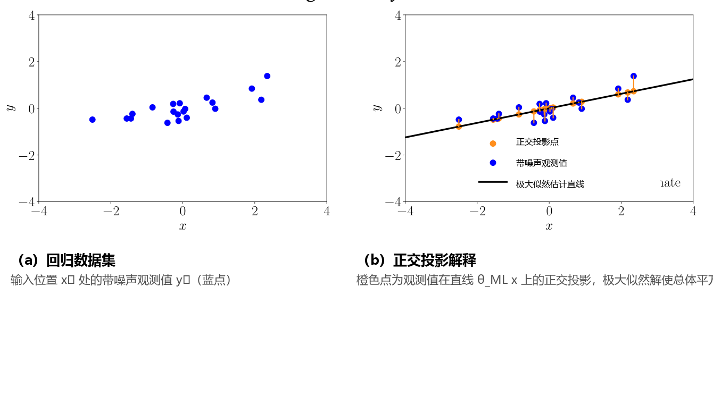

## 9.4 极大似然作为正交投影

在完成了大量复杂的代数推导以求取极大似然与 MAP 估计之后，我们现在为极大似然估计提供一个直观清晰的几何解释。

让我们首先考虑一个简单的线性回归设定：

$$
y = x\theta + \epsilon , \quad \epsilon \sim \mathcal{N}\left(0, \sigma^2\right) ,
\tag{9.65}
$$

其中我们考虑通过原点的线性函数 $f: \mathbb{R} \to \mathbb{R}$（为清晰起见，此处暂不引入特征映射）。参数 $\theta$ 决定了直线的斜率。图 9.12(a) 展示了一个典型的一维数据集。

  
  
<b>图 9.12</b> 最小二乘的几何解释。(a) 数据集；(b) 解释为投影的极大似然解。

给定训练数据集 $\{(x_1, y_1), \ldots, (x_N, y_N)\}$，回顾 9.2.1 节的结果，斜率参数的极大似然估计量为：

$$
\theta_{\text{ML}} = (\boldsymbol{X}^\top \boldsymbol{X})^{-1}\boldsymbol{X}^\top \boldsymbol{y} = \frac{\boldsymbol{X}^\top \boldsymbol{y}}{\boldsymbol{X}^\top \boldsymbol{X}} \in \mathbb{R} ,
\tag{9.66}
$$

其中 $\boldsymbol{X} = [x_1, \ldots, x_N]^\top \in \mathbb{R}^N$，$\boldsymbol{y} = [y_1, \ldots, y_N]^\top \in \mathbb{R}^N$。

这意味着，对于训练输入 $\boldsymbol{X}$，我们获得训练目标的最佳（极大似然）重构为：

$$
\boldsymbol{X}\theta_{\text{ML}} = \boldsymbol{X}\frac{\boldsymbol{X}^\top \boldsymbol{y}}{\boldsymbol{X}^\top \boldsymbol{X}} = \frac{\boldsymbol{X}\boldsymbol{X}^\top}{\boldsymbol{X}^\top \boldsymbol{X}}\boldsymbol{y} ,
\tag{9.67}
$$

即我们获得了 $\boldsymbol{y}$ 与 $\boldsymbol{X}\theta$ 之间具有最小二乘误差的最优近似。

由于我们寻找的是方程 $\boldsymbol{y} = \boldsymbol{X}\theta$ 的解，我们可以将线性回归视为求解线性方程组的问题。因此，我们可以将第 2 章和第 3 章中讨论的线性代数与解析几何概念紧密联系起来。特别是，仔细观察式 (9.67)，我们发现式 (9.65) 中的极大似然估计量 $\theta_{\text{ML}}$ 实际上是将观测目标向量 $\boldsymbol{y} \in \mathbb{R}^N$ _正交投影（orthogonal projection）_ 到由输入向量 $\boldsymbol{X}$ 所张成的一维子空间上！回顾 3.8 节关于正交投影的结论，我们可以识别出：
- $\frac{\boldsymbol{X}\boldsymbol{X}^\top}{\boldsymbol{X}^\top \boldsymbol{X}}$ 是投影矩阵；
- $\theta_{\text{ML}}$ 是投影在由 $\boldsymbol{X}$ 张成的 $\mathbb{R}^N$ 的一维子空间中的坐标；
- $\boldsymbol{X}\theta_{\text{ML}}$ 则是 $\boldsymbol{y}$ 在该子空间上的正交投影向量。

因此，极大似然解通过在由 $\boldsymbol{X}$ 张成的子空间中寻找与对应观测值 $\boldsymbol{y}$“最近”的向量，提供了几何上的最优解——这里的“最近”是指函数值 $y_n$ 到 $x_n\theta$ 的平方距离总和最小。这一几何最优性正是由正交投影实现的。图 9.12(b) 展示了带噪声观测值在使得原始数据集与其投影之间平方距离最小的子空间（固定 $x$ 坐标）上的投影，这完全对应于极大似然解。

在具有向量值特征 $\boldsymbol{\phi}(\boldsymbol{x}) \in \mathbb{R}^K$ 的一般线性回归情形中：

$$
y = \boldsymbol{\phi}^\top(\boldsymbol{x})\boldsymbol{\theta} + \epsilon , \quad \epsilon \sim \mathcal{N}\left(0, \sigma^2\right) ,
\tag{9.68}
$$

我们同样可以将极大似然结果

$$
\boldsymbol{y} \approx \boldsymbol{\Phi}\boldsymbol{\theta}_{\text{ML}} ,
\tag{9.69}
$$

$$
\boldsymbol{\theta}_{\text{ML}} = (\boldsymbol{\Phi}^\top \boldsymbol{\Phi})^{-1}\boldsymbol{\Phi}^\top \boldsymbol{y}
\tag{9.70}
$$

解释为向 $\mathbb{R}^N$ 中由特征矩阵 $\boldsymbol{\Phi}$ 的列向量所张成的 $K$ 维子空间上的正交投影；参见 3.8.2 节。

若用于构建特征矩阵 $\boldsymbol{\Phi}$ 的特征基函数 $\phi_k$ 是 _标准正交（orthonormal）_ 的（见 3.7 节），我们将得到一个特殊情形：$\boldsymbol{\Phi}$ 的各列构成一组标准正交基（见 3.5 节），从而满足 $\boldsymbol{\Phi}^\top \boldsymbol{\Phi} = \boldsymbol{I}$。此时投影矩阵简化为：

$$
\boldsymbol{\Phi}(\boldsymbol{\Phi}^\top \boldsymbol{\Phi})^{-1}\boldsymbol{\Phi}^\top \boldsymbol{y} = \boldsymbol{\Phi}\boldsymbol{\Phi}^\top \boldsymbol{y} = \left( \sum_{k=1}^K \boldsymbol{\phi}_k \boldsymbol{\phi}_k^\top \right) \boldsymbol{y} ,
\tag{9.71}
$$

此时不同特征之间的耦合完全消失，极大似然正交投影退化为 $\boldsymbol{y}$ 向各个基向量 $\boldsymbol{\phi}_k$（即 $\boldsymbol{\Phi}$ 的各个列向量）上独立投影的简单线性叠加。信号处理中许多常用的基函数（如小波基和傅里叶基）都是正交基函数。当所选基不是正交基时，我们可以通过施密特正交化过程（Gram-Schmidt process，Strang, 2003）将一组线性无关的基函数转化为标准正交基。
